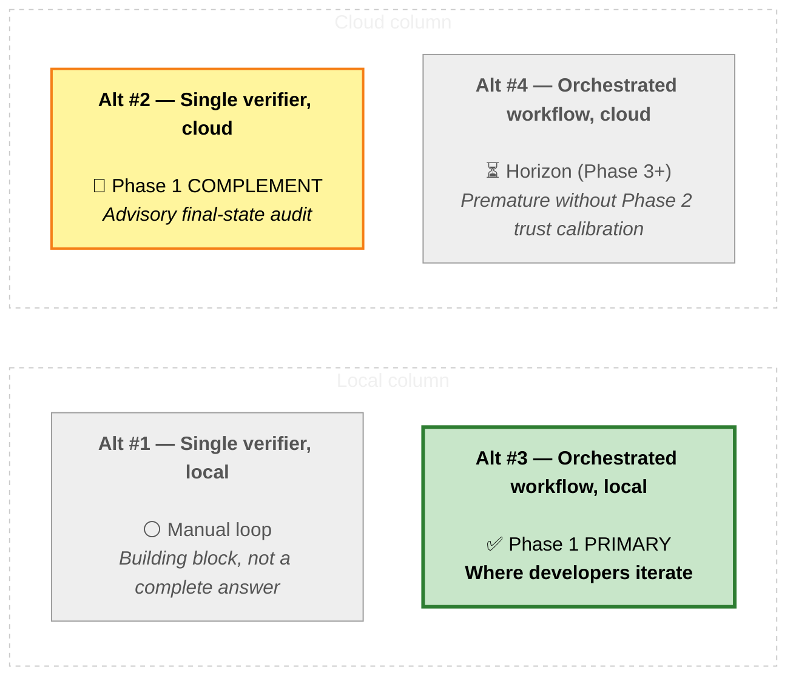
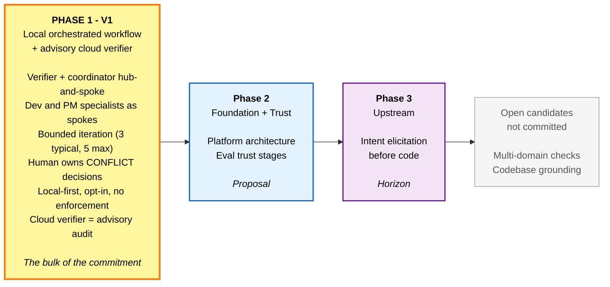
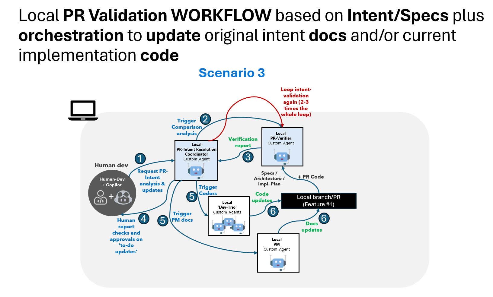
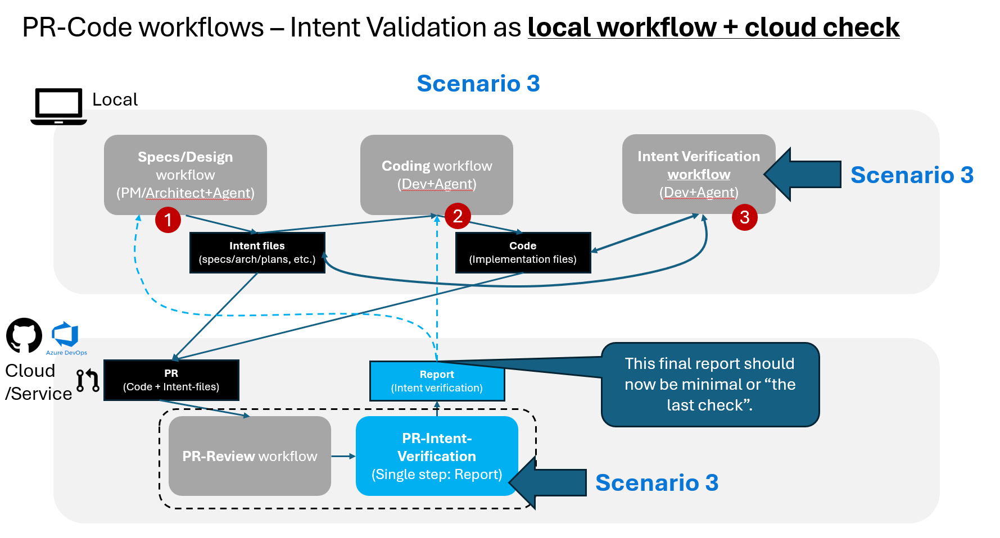

# PR Intent Verification — Feature Strategy

*The bulk of this document describes Phase 1 (v1); Phase 2 and Phase 3 are deliberately lightly defined and treated as proposals to be debated only after v1 is polished.*

---

## 1. Executive Summary

AI-assisted code generation usually produces multiple gaps between the **intent docs** that describe what a feature or a change should do (specs, architecture notes, plans, contracts, task lists) and the **actual code** the AI produces. We call this gap **drift**. Drift is bidirectional: code can be **BEHIND** intent (the spec promises behavior the code does not implement) or **AHEAD** of intent (the code implements behavior the spec never described). Either direction usually needs to be improved and balanced before merging a PR, since it might not be compliant with the original/evolved goals.

Detection of drift is not the hard problem. The hard problem is **end-to-end loop latency** — the "wait time" from when an intent verification report is generated to when a developer starts analyzing it, plus the time and friction a human spends closing the multiple identified gaps in a report. On top of that, this is usually not solved in a single pass or loop. Every loop a developer has to manually re-trigger, every conflict that has to be re-explained from scratch, every round-trip between an in-editor agent and a cloud review tool, is friction that compounds. If the tool only flags problems in a report attached to a PR's comment in the service (e.g., ADO or GitHub.com) and leaves the developer to fix them by hand, it's useful — it surfaces insights — but it will generate latency/lag, so it's not a real productivity or acceleration boost of the E2E PR lifecycle.

This strategy therefore proposes a phased path that is asymmetric on purpose:

- **Phase 1 (v1) — local orchestrated workflow, polished end-to-end, plus a narrow advisory cloud/service check.** This is where the overwhelming majority of the design, build, and validation investment lands. We deliberately want this phase to be deep, opinionated, and grounded in a small number of real teams using it daily before we extend the surface area.
- **Phase 2 — platform foundation and trust calibration.** The shared plumbing — a common verdict schema, a candidate-changeset lifecycle, and host-neutral adapters — that lets the same verifier and coordinator run unchanged across the IDE, the PR service, and an agent's working tree; plus the evaluation work that lets the cloud verdict graduate from an advisory FYI into an evidence-backed gate. Lightly defined here. Discussed in detail only after Phase 1 is stable and we have real usage signal.
- **Phase 3 — upstream intent elicitation for intent-docs improvement.** *Elicitation* here means drawing the intent out of a human *before* any code is written — the assistant interrogates the developer or PM, surfaces ambiguity, and produces a candidate intent doc the human signs off on. This addresses the case where the intent docs Phase 1 relies on are missing, vague, or stale. Lightly defined here. Discussed in detail only after Phase 2 lands.

Four implementation alternatives were considered, factoring cleanly into a two-by-two of *where* the work runs (developer's local IDE vs. cloud PR service) and *what* runs (a single verifier agent vs. an orchestrated multi-agent workflow). Phase 1 picks the **local orchestrated workflow** as the primary loop where developers iterate, and adds the **cloud single verifier** as an explicit, narrow, advisory final-state audit on the real pull request. The two together are the v1 commitment.

The strategy carries known risks, like the **intent-doc parity** observation that the value of a cloud check depends on the intent docs being the same as the docs used locally. This is surfaced explicitly in Concerns and is part of why Phase 2 exists.

---

## 2. Context

The shift to AI-assisted development changes the unit of work. Where a developer once wrote each line of code by hand and could be expected to keep the surrounding documentation in their head, an AI assistant now produces large changesets in a single turn, and produces them by drawing on whatever context the human (or another agent) hands it. The intent docs that ought to anchor those changesets — the spec, the architecture note, the implementation plan, the contract, the data model, the task list — are now both more important and more easily ignored. They are more important because they are the only durable record of what the change was supposed to do. They are more easily ignored because the assistant will cheerfully produce code that compiles, runs, and looks plausible whether or not it actually matches the intent.

Drift is the natural and inevitable consequence. Two directions matter, and they require different responses:

- **Code BEHIND intent.** The spec, plan, or contract calls for a behavior, capability, or constraint that the produced code does not yet implement. This is the easier direction to detect because the intent doc is a positive description that can be checked against the changeset. The response is usually to extend the code.
- **Code AHEAD of intent.** The produced code implements behavior, capabilities, or constraints that no intent doc describes. This is the harder direction because there is nothing to check against — the only way to surface it is to compare the changeset against the docs and notice the surplus. The response is usually to update the intent doc, occasionally to remove the code, and sometimes to escalate a genuine design question.

Both directions, left unresolved, cause the same downstream damage: intent docs become stale, the team loses the ability to use them as ground truth, and the AI assistant loses the highest-quality context it had. The team enters a slow drift into a state where nobody is sure what the system is actually supposed to do.

### 2.1 Problem to Be Solved

Detecting drift is the easy half. The **real problem** is the cumulative time and cognitive load a developer spends iterating to close the gap once it is found — what the rest of this document calls **end-to-end loop latency**.

A drift detector that fires once at the end of a pull request and forces the developer to mentally reload the change, manually re-run the check, manually triage suggested edits, and manually rebut the ones that are wrong is not a step-change. It is a polite linter that hands the fix work back to the human. A workflow that catches drift continuously, in the same context where the developer is working, and orchestrates the closing of the gap with the right specialists involved at the right time, is a step-change.

The problem this strategy is built to solve, therefore, is not *can we detect drift* — it is *can we close the loop fast enough that closing drift becomes a default behavior of the tooling rather than a discipline imposed on the developer*. This framing is what shapes the alternatives considered later and the phase recommended for commitment.

---

## 3. Intent Verification Definition

The terms used throughout this document are precise. They are listed here once and then used consistently.

**Intent docs** are the artifacts that describe what a code change *should* do — specifications, architecture notes, implementation plans, contracts, data models, and task lists. They are the durable record of intent and the authoritative reference against which work is judged.

**A candidate changeset** is a concrete set of file edits — staged, in a working branch, or in a pull request — proposed by a developer or by an AI coding assistant. It is the unit of work being verified.

**Drift** is the gap between a candidate changeset and the intent docs that apply to it. Drift is bidirectional. Findings are classified as:
- **BEHIND** — the intent docs describe behavior the code does not implement.
- **AHEAD** — the code implements behavior the intent docs do not describe.
- **CONFLICT** — the right call cannot be made automatically and requires a human decision.
- **ALIGNED** — code and intent docs agree.

**Intent verification** is the disciplined activity of comparing a candidate changeset against its intent docs, classifying each finding into the categories above, and surfacing what needs to close. It is *audit*, not *generation*. A tool that performs this audit in a single pass and emits a verdict is a **verifier**. A multi-agent system that takes that verdict, dispatches specialists to close BEHIND and AHEAD findings, iterates the loop, and pauses on CONFLICTs for the human is a **resolution workflow** (also referred to as the *resolution loop*). The verifier and the resolution workflow are distinct designs and the strategy below treats them that way.

---

## 4. Strategic Context & North Star

### 4.1 Strategic Context & Challenge

AI-assisted development changes the unit of work and the unit of risk. The team that adopts an AI coding assistant gains immediate leverage on volume — more code, faster — but pays for that leverage with a new and structural weakness: the intent docs that ought to anchor the work become both more important (the only durable record of what the change is supposed to do) and more easily ignored (the assistant will cheerfully produce code whether or not it matches the intent).

The strategic challenge is not "can we detect when this happens." Detection is the easier half. The strategic challenge is **end-to-end loop latency** — the time and cognitive load a human spends iterating to close the gap once it is found. A platform that surfaces drift but leaves the closing of it to ad-hoc human effort produces a polite linter, not a productivity step-change. The platform that wins is the one whose loop is short enough, opinionated enough, and trustworthy enough that the human stays in the loop on conflicts and lets the system close the rest.

Without addressing loop latency directly, the leverage that AI assistance promised erodes silently in the background. Intent docs become stale, the team loses its ability to use them as ground truth, and the assistant loses the highest-quality context it had. The cost is not visible in any single change; it accumulates across many changes and many sprints, and by the time it shows up in production or in a stalled refactor, the root cause is hard to trace back.

The strategic move, therefore, is to invest in the *loop*, not just the *check*.

### 4.2 North Star

The aspirational end-state is a world where intent and code stay aligned automatically as a natural property of how AI-assisted development works — not as a separate quality phase, not as a review gate, not as a reviewer's diligence. In that world, the verifier and the resolution workflow are infrastructure, the human is involved only on genuine design conflicts, and intent docs remain a current and trusted source of truth that humans, assistants, and downstream agents all rely on.

The North Star is the direction, not the v1 commitment. The phased path proposed in §7 picks a sequenced route toward it, with explicit honesty about what we are and are not promising in v1.

---

## 5. High-level Vision

The vision motivating this work is simple: as AI-assisted development scales, the team that closes the intent-to-code loop fastest gets the most leverage from AI assistance, and that closing must become a default behavior of the tools, not a discipline imposed on the developer.

**Why now.** Drift is already happening in real teams using AI assistants today. Where it goes unchecked, intent docs lose authority and the leverage from AI assistance silently shrinks. Where it is closed by hand, the cost is borne by the developer in time and cognitive load. The opportunity is to absorb the closing work into the tooling before either failure mode entrenches itself as the team's default.

**High-level goals.**
- Make intent-drift detection and resolution a default in the developer's working session, not a separate phase.
- Earn the right to enforce by first earning the right to advise.
- Extend upstream when the platform is ready, so intent is captured *before* code is written, not just verified after.

### 5.1 Guiding Principles

Three principles are implicit in everything that follows. They are the design choices we are making before we make any specific implementation choice.

**Iterative loops beat single-pass checks.** A one-shot verifier that runs once at the end of a change and emits a verdict is fundamentally limited by what one pass can see and what one human can absorb in one sitting. Closing real drift, especially the AHEAD direction where intent docs and code both need to evolve, takes several short, bounded passes — typically three, capped at five — with the human making the calls on conflicts. The system must be designed for this from day one, not retrofitted.

**Intent docs are the ground truth, with caveats.** We accept the intent docs the team has produced as the artifact of record. We do not silently rewrite them. When the docs and the code disagree, the system surfaces the disagreement, classifies it (BEHIND / AHEAD / CONFLICT / ALIGNED), and asks a human to resolve it. This preserves the docs' authority and keeps the human accountable for the decision, even as the assistant does the work of finding and proposing changes. The caveat — addressed in Concerns — is that this assumes intent docs exist and are reasonably well maintained. Where they do not, the strategy's value is limited until Phase 3 lands.

**Local-first, then cloud.** We earn the right to add cloud automation by first proving the value in the developer's IDE. The local loop is where the human and the assistant are co-present and where the loop latency is lowest. Anything we add at the pull-request layer is a complement to that local loop, not a replacement, and we add it only after the local loop has proven valuable. This sequencing is deliberate, and Phase 1 is the test of whether it holds.

---

## 6. Alternatives Considered

Four implementation alternatives present themselves. They factor cleanly into a two-by-two: *where* the work runs (local IDE vs. cloud PR service) crossed with *what* runs (a single-pass verifier agent vs. an orchestrated multi-agent workflow).

X-axis (left → right): **local (IDE-attached) → cloud (PR-attached)**.
Y-axis (top → bottom inside each column): **single verifier (one-shot) → orchestrated workflow (multi-agent loop)**.

Legend: 🟢 green (bold border) = the Phase 1 primary commitment · 🟡 yellow = the Phase 1 complement (advisory only) · ⚪ gray = a building block (Alt #1) or a deferred horizon (Alt #4).

### 6.1 Alt #1 — Single verifier, local

A single verifier agent runs in the developer's IDE on demand. It reads the candidate changeset, compares it to the intent docs, and emits a verdict. The developer reads the verdict, decides what to act on, manually triggers the relevant fixes (often by re-prompting a coding assistant), and then re-runs the verifier to check. This is the simplest design and matches what most teams would build first.

The problem is not the verifier — it is the *loop the developer has to operate by hand*. Every iteration requires the developer to re-establish context, decide which findings matter, prompt the right tool, and re-run the check. The verifier itself is single-pass and stateless; the multi-loop pain is human-driven. Many failed solutions in this space sit here because the alternative is mistaken for a complete answer. It is not. It is a building block that needs an orchestrator around it.

### 6.2 Alt #2 — Single verifier, cloud

The same single verifier, attached to the pull request in the cloud service. The verifier runs automatically when the PR is opened or updated, reads the diff and the intent docs as they exist on the PR branch, and posts a verdict as a comment or check. This is operationally attractive: there is nothing for the developer to install, the verdict is visible to reviewers, and it produces an audit trail in the PR.

The honest limitation is twofold. First, the verifier has no orchestrator and so still imposes the manual-loop problem of Alt #1, only now with longer round-trip times because each iteration goes through the PR system. Second, the value of the cloud check depends on the intent docs in the PR being the same docs the developer was iterating against locally. If they have drifted between local "done" and pushed PR, the cloud verifier and the local loop can produce contradictory verdicts and confuse rather than help.

### 6.3 Alt #3 — Orchestrated workflow, local *(Phase 1 primary)*

The verifier is one specialist in a hub-and-spoke workflow that runs in the developer's IDE. A coordinator agent reads the verdict, classifies each finding as BEHIND, AHEAD, or CONFLICT, routes BEHIND findings to a development specialist (which produces the code change), routes AHEAD findings to a product or specification specialist (which produces the doc change), pauses on CONFLICT for the human, re-invokes the verifier after each pass, and converges or escalates. The developer stays in the IDE, watches the loop progress, intervenes only on conflicts, and ends the session with a changeset whose code and intent docs agree.

This is the design the local-first doctrine points to and it directly attacks the loop-latency cost. It is also the alternative that has the most novel surface area to get right — the coordinator's routing logic, the bounded-iteration discipline, the conflict-handling pattern, the back-pressure to the human on truly ambiguous cases.

### 6.4 Alt #4 — Orchestrated workflow, cloud

The same multi-agent workflow lifted into the PR service. The coordinator runs in cloud, dispatches to dev and PM specialists also running in cloud, iterates on the PR branch, and produces a PR whose code and docs have already converged before a human reviewer sees them.

This is the most ambitious and the most operationally risky to commit to early. It assumes the local loop has been proven, that the specialist agents are well-behaved enough to run unattended on real code, that the trust calibration to run autonomously exists, and that the underlying platform (verdict schema, candidate-changeset lifecycle, host-neutral adapters) has matured enough to support it. Premature commitment here is one of the larger risks the strategy guards against.

### 6.5 Why the Phase 1 bet pairs Alt #3 with Alt #2

The recommendation is to commit Phase 1 to **Alt #3 as the primary developer loop**, and to add **Alt #2 in a narrow, advisory-only role** as a final-state audit on the real PR. The two play complementary parts: Alt #3 carries the iteration cost where the developer can absorb it cheaply, and Alt #2 catches any drift introduced between the local "done" state and what actually ended up in the PR — for example, a last-minute edit pushed without re-running the local loop, or an intent doc that was modified after the local convergence. The cloud check stays advisory in v1 because the trust calibration to make it gating is itself a Phase 2 question.

---

## 7. The Solution

The solution is a **phased, sequenced** path. Invest deeply in Phase 1, and treat Phase 2 and Phase 3 as proposals to be revisited only after v1 is polished. The asymmetry is intentional: this is not a balanced roadmap, it is a sequenced one. Phase 1 carries the weight; Phases 2 and 3 are sketched so the direction is clear, but they are not commitments.

### 7.1 Phased Path

The sequence is: prove the local loop works for real teams; then add the platform plumbing and trust calibration that lets the cloud component graduate from advisory to gating; then move upstream to elicit intent before code is written rather than verifying after. The two "open candidates" — broader multi-domain checks and codebase-grounding digests — remain on the table but are not promoted; they are noted so that signal can be revisited later.

### 7.2 Phase 1 — V1: Local Orchestrated Workflow + Advisory Cloud Verifier

This is the section that matters. Phase 1 is the bet, and the rest of the document exists to frame it.

#### 7.2.1 Scope — what is in v1 and what is not

In v1, the system must do the following well, on real changesets, in the developer's IDE, end-to-end, repeatedly:

- Accept a candidate changeset (a set of file edits, staged or in a working branch) and a set of intent docs the developer points it at.
- Verify the changeset against the intent docs and emit a structured verdict that classifies each finding as BEHIND, AHEAD, CONFLICT, or ALIGNED, with file and line evidence for each.
- Run a coordinated resolution loop that, without further developer prompting, dispatches BEHIND findings to a development specialist (which produces code edits), dispatches AHEAD findings to a specification or product specialist (which produces doc edits), and pauses on CONFLICT findings to capture a human decision before continuing.
- Re-invoke the verifier after each pass, iterate until the verdict converges or the bounded-iteration limit is hit, and end the session with a changeset whose code and docs agree (or with an explicit, surfaced reason why they do not).
- Optionally and separately, run the cloud verifier on the pushed PR as an advisory final-state audit and surface its verdict as a PR comment.

In the diagram below it's shown how the local workflow with multiple agents handinf-off would work (Comparable to workflow POC):

What is *not* in v1: cloud orchestration of the multi-agent loop; gating enforcement; broader multi-domain checks beyond intent (security, tech debt, style); fully automatic intent elicitation; and any flow that silently mutates intent docs without a human's call on AHEAD findings.

#### 7.2.2 Architecture pattern — hub-and-spoke with explicit roles

The local workflow is a hub-and-spoke pattern, not a pipeline. The hub is a coordinator. The spokes are role-specialized agents that the coordinator dispatches work to. The roles are intentionally few:

- **Verifier.** Single-pass. Reads the changeset and the intent docs and emits the structured verdict. Does not iterate. Does not fix. Its job is to see the gap honestly and report it.
- **Coordinator.** Iterates. Reads the verifier's verdict, classifies each finding, routes BEHIND findings to the dev specialist, routes AHEAD findings to the PM specialist, pauses on CONFLICT, re-invokes the verifier after each pass, and decides when the loop is done.
- **Dev specialist.** Owns code edits to close BEHIND findings.
- **PM specialist.** Owns doc edits to close AHEAD findings.
- **The human developer.** Owns CONFLICT decisions and owns the decision to accept or reject any of the proposed changes.

The cloud verifier in v1 is the same verifier agent (or a functional sibling of it) running against the pushed PR. It does not orchestrate. It does not iterate. It posts an advisory verdict that the developer or reviewer can act on.

#### 7.2.3 Loop discipline — bounded iteration, human in the loop on conflicts

The loop must be bounded. The directional guidance settled on three iterations as a typical target and five as a hard maximum, and that bound is preserved here. Bounding is what keeps the loop from becoming the same ad-hoc human-driven cycle Alt #1 suffers from, only now hidden inside automation.

CONFLICT is a first-class finding type, not an edge case. A CONFLICT is a finding the coordinator cannot route automatically — for example, an AHEAD finding where the code's surplus behavior is plausibly intentional and removing it or documenting it is a genuine design call. The coordinator must pause on CONFLICT, surface it to the developer with enough context to decide, capture the decision, and only then continue. This is what keeps the human accountable for the change rather than the agent.

#### 7.2.4 Operating model — how a developer actually uses this

In daily use, the developer opens a working branch with a candidate changeset, invokes the workflow from the IDE, points it at the intent docs that apply to the change, and observes the loop. The verifier runs first and emits its verdict. The coordinator picks up the verdict and begins resolving. Within a small number of iterations, most findings close themselves — BEHIND findings produce code edits the developer reviews, AHEAD findings produce doc edits the developer reviews, ALIGNED findings disappear. The developer's only required participation is at CONFLICTs and at the final accept-or-reject step. When the loop converges (or hits the iteration cap with remaining work), the developer either commits and pushes or iterates manually on whatever is left.

When the PR is pushed, the advisory cloud verifier runs once on the real PR state and posts its verdict as a comment. If the cloud verifier reports drift the local loop did not, that signals one of two things: either the intent docs in the PR differ from what the local loop saw, or a last-minute change escaped the local loop. 

In the diagram below it's shown how the scenario (local loop + cloud-check) would work:

#### 7.2.5 Adoption motion — opt-in, local-first, no enforcement

In v1 the workflow is opt-in. A team adopts it by installing it locally and choosing to invoke it. There is no required gate, no required policy, no enforcement. The cloud verifier's verdict is advisory: it appears as a PR comment, it does not block merge. This is the *local-first* doctrine made concrete, and it is the explicit price we pay for not having the trust calibration that would let us gate. The trust calibration is a Phase 2 question.

#### 7.2.6 What success in Phase 1 looks like

Phase 1 has succeeded if a team using it can take a real changeset through a full BEHIND-then-AHEAD resolution loop within a single working session, can complete that loop with a small and bounded number of iterations, can clearly identify which CONFLICTs needed their judgment and which findings resolved themselves, and can articulate that the workflow reduced the loop time they would have spent doing the same closure manually. Success is not a number we invent in advance; it is empirical and observed from real teams using v1 in real work. Trust in the verifier itself is the same — it is calibrated by use, not asserted by the strategy.

The deliberately omitted measures — quantitative thresholds, percentage targets, latency budgets, accuracy floors — are omitted because the meaningful versions of those numbers can only be set by watching v1 in real use. Picking them now would be guessing.

### 7.3 Phase 2 — Platform Foundation and Trust Calibration *(proposal, not commitment)*

Phase 2 is lightly defined here on purpose. It is a proposal to be debated in detail only after Phase 1 is polished and a small number of teams are using it in real work. Two candidate workstreams stand out from our analysis.

**Platform architecture.** The single most important post-v1 workstream from an architecture point of view. Phase 1 carries an explicit open risk — intent-doc parity between the developer's local state and the pushed PR — that has no clean solution path without a first-class platform abstraction. A platform-architecture spec would deliver a stable verdict schema, a candidate-changeset lifecycle that is the same whether the changeset is in the IDE, in a PR, or in a coding agent's working tree, and host-neutral adapters that let the same verifier and coordinator run unchanged across multiple PR systems and pre-PR surfaces. Without this layer, every subsequent feature reinvents the same primitives. Customers do not ask for plumbing, but plumbing is what unblocks everything else.

**Eval trust stages.** Phase 1's cloud verifier is advisory by design because we do not yet have calibrated confidence in its verdicts. A trust-staging workstream would define an explicit sequence — advisory, then conditionally gating on high-confidence categories, then broadly gating — backed by evaluation pipelines that measure verdict quality on representative changesets. Without this, the cloud verifier remains forever an FYI comment and the platform never earns the right to enforce. With it, the cloud verifier graduates into a real gate, on a schedule the team chooses based on evidence.

Both of these are proposals. The case for each will be re-made with Phase 1 evidence in hand.

### 7.4 Phase 3 — Upstream Intent Docs Elicitation *(horizon, lightly defined)*

Phase 3, even more lightly defined. Phase 1 verifies that code matches intent docs. Phase 3 asks the prior question: where do the intent docs come from in the first place, and how do we extract enough tacit knowledge from a human into a doc the verifier can later check against? An intent-elicitation-loop workstream would propose an upstream pass — before any code is generated — in which the assistant interrogates the human, surfaces ambiguity, and produces a candidate intent doc the human signs off on. This addresses the case where intent docs are missing, vague, or stale, which today limits what the Phase 1 verifier can do. It is the most ambitious of the three phases and the right one to defer until the platform under it is stable.

This feature would probably very much related to PM's work or devs/architects work when creating the "intent docs", such as specs docs, architecture docs and implementation plan docs, based on elicitation (questions/answers workflow).

### 7.5 Open Candidates *(not committed)*

Two further candidate workstreams surfaced during analysis but are not promoted into the phased path. They are recorded here so that signal can be revisited later.

- **Broader multi-domain checks.** Beyond intent vs. code, a coordinator could dispatch discrete evaluations for security, tech debt, and style as independent specialists. The shape of the work is similar to Phase 1 but the scope is larger and the value depends on the platform foundation Phase 2 would deliver.
- **Codebase grounding digests.** A complementary capability that produces a structured digest of an existing codebase's architectural patterns, so the verifier and the dev specialist can reason about what *fits* the codebase, not just what matches the spec. Valuable for codebases with strong implicit conventions; not on the critical path.

Both remain candidates. Neither is part of the v1 commitment or the Phase 2 / Phase 3 proposals.

---

## 8. Concerns and Challenges

Five concerns are worth surfacing explicitly. They are not reasons not to proceed; they are reasons to design Phase 1 honestly and to keep Phase 2 in view.

**1. Fine-grained noise — small drifts treated like big ones.** A verifier that emits every nit at the same severity as every real gap quickly trains its users to ignore it. Phase 1 must surface findings at a level the human can usefully triage, and must be willing to suppress or roll up findings that are technically present but practically irrelevant. This is a design discipline as much as an engineering one.

**2. Premature cloud workflow.** The largest strategic risk is the temptation to skip **Alt #3 (orchestrated workflow, local — the IDE-attached multi-agent loop where the developer iterates)** and go straight to **Alt #4 (orchestrated workflow, cloud — the same multi-agent loop lifted into the PR service, running unattended against the pushed branch)** before the local loop has been polished. The platform foundation to attempt Alt #4 exists; the reason to resist is not capability but loop economics. Every step of the resolution loop — verifier → coordinator → dev or PM specialist → re-verify — pays a latency cost. In a local inner loop, that cost is measured in seconds and the developer is co-present to absorb it. In a cloud loop attached to a PR, the same step pays push/queue/run/comment round-trips, and a three-to-five-iteration resolution that takes a few minutes locally can take an order of magnitude longer in cloud, with the developer context-switched away between steps. Lifting the loop to cloud before it has been tuned locally amplifies every rough edge — noisy findings, indecisive routing, weak conflict surfacing — into a slow, expensive cycle that erodes trust before the platform has a chance to earn it. The strategy therefore stages the cloud component as a narrow, advisory single-verifier in v1, and defers the orchestrated cloud loop until the local one has proven its iteration economics.

**3. Honest scoping — drift is not equally painful for every workload.** The cost of drift depends on what kind of work the team is doing, not on whether the tool can detect it. Two ends of the spectrum make the point.

On one end are **spec-bound workloads** — services with published contracts, schemas, SLAs, or downstream consumers. Here the intent docs *are* the interface other teams and systems depend on. Even a small gap between the spec and the code can break a consumer, violate an SLA, or trigger a coordinated rollback. For these workloads drift is expensive whether it is caught early or late, and the value of closing it is high.

On the other end are **exploratory workloads** — prototypes, research code, internal tooling, and small-team work where the docs and the code naturally co-evolve in tight feedback. Here there is no external contract to honor; whatever the team agreed to yesterday is the spec, and rewriting it tomorrow is part of the work. A verifier that flags drift in this context produces findings the team will rationally ignore, because for that workload drift is not a real cost.

The practical consequence is that we will not market the platform as universally applicable, and we will not pick early-adopter teams at random. Phase 1 will be deployed first where the pain is sharpest — teams with real specs, real contracts, and real consequences for getting them wrong — and we will be explicit about the workload profiles it fits and the ones it does not. This is a scoping discipline, not a limitation we are apologizing for: it is how we make sure the first signals we collect come from workloads where the platform's value actually shows up.

**4. Intent-docs-exist precondition.** Phase 1 is only valuable to the degree that intent docs exist and are reasonably maintained. For teams without an intent-docs culture, the platform offers little until Phase 3's elicitation work lands. This is the deepest assumption underneath the whole strategy, and surfacing it changes how we pick the first set of teams to deploy v1 with: they should be teams who already write specs, plans, or contracts, not teams we hope to convince to start.

**5. Intent-doc parity (local ↔ cloud).** The advisory cloud verifier in Phase 1 reads the intent docs as they exist on the pushed PR branch. The local workflow reads them as they exist in the developer's working tree. If these have drifted, the two can disagree, and a developer can be confused by a cloud verdict that contradicts a local "all clear". Phase 1 surfaces this honestly; Phase 2's platform-architecture workstream is the closure path. Until Phase 2 lands, expect occasional contradictions and design the user-facing wording of the cloud verdict to acknowledge it.

---

## Appendix A — Notes and References

**Implementation status.** The verifier agent and the resolution-coordinator workflow are implemented in this repository (`.github/agents/` + `.github/skills/`) and exercised on real examples. They are the operational source of truth for Phase 1; the design specs ([F1](../../02-Features/F1-pr-intent-verifier-agent/pr-intent-verifier-agent-specs.md), [F2](../../02-Features/F2-pr-intent-verification-workflow/pr-intent-verification-workflow-design.md)) are kept aligned with them as the design-of-record.

**Source documents referenced by this strategy.**

*Strategy and POV:*
- [`Specs/01-Global/03-pr-intent-specs-umbrella-plan/pr-intent-specs-umbrella-plan.md`](../03-pr-intent-specs-umbrella-plan/pr-intent-specs-umbrella-plan.md) — umbrella map of the spec family by phase.
- [`Specs/01-Global/01-pr-intent-customer-discovery/pr-intent-customer-discovery-coverage-analysis.md`](../01-pr-intent-customer-discovery/pr-intent-customer-discovery-coverage-analysis.md) — coverage matrix for customer-discovery signals.
- [`Specs/01-Global/01-pr-intent-customer-discovery/pr-intent-validation-customer-discovery-analysis.md`](../01-pr-intent-customer-discovery/pr-intent-validation-customer-discovery-analysis.md) — customer signal analysis.

*Phase 1 design specs:*
- [`Specs/02-Features/F1-pr-intent-verifier-agent/pr-intent-verifier-agent-specs.md`](../../02-Features/F1-pr-intent-verifier-agent/pr-intent-verifier-agent-specs.md) — the single-pass verifier specification.
- [`Specs/02-Features/F2-pr-intent-verification-workflow/pr-intent-verification-workflow-design.md`](../../02-Features/F2-pr-intent-verification-workflow/pr-intent-verification-workflow-design.md) — the orchestrated resolution workflow specification.

*Implementation artifacts (operational source of truth):*
- `.github/agents/pr-intent-verifier.agent.md` — standalone verifier agent.
- `.github/agents/pr-intent-resolution-coordinator.agent.md` — orchestrated-workflow coordinator.
- `.github/skills/intent-verification/SKILL.md` — verifier methodology skill.

---

*End of strategy document.*
