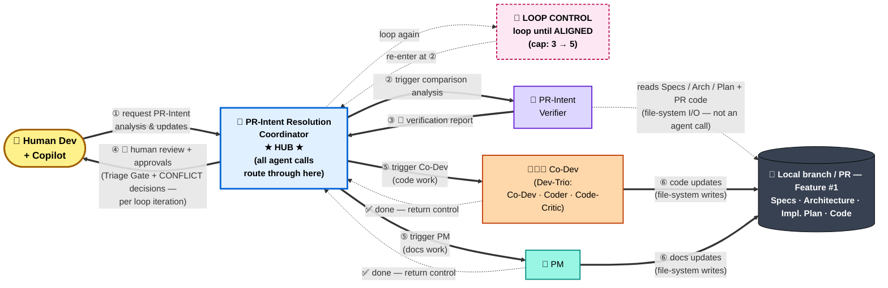
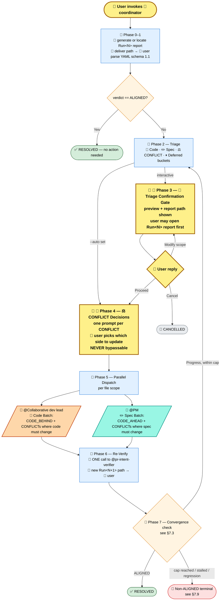
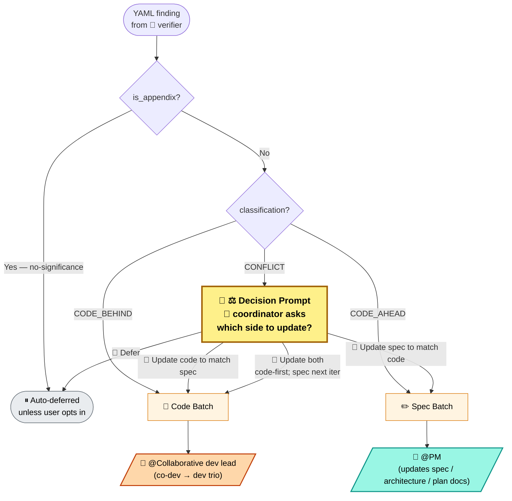
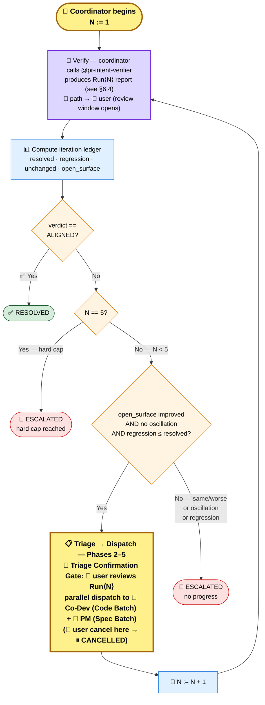

# PR Intent Verification Workflow — Technical Design

| Field | Value |
|-------|-------|
| Feature | End-to-end PR Intent Verification & Resolution loop |
| Status | IMPLEMENTED — verifier + coordinator + workers shipped and in active use; this doc is the design-of-record |
| North star | [`../../01-Global/02-pr-intent-verification-strategy/pr-intent-verification-strategy.md`](../../01-Global/02-pr-intent-verification-strategy/pr-intent-verification-strategy.md) |
| Companion spec | [`../F1-pr-intent-verifier-agent/pr-intent-verifier-agent-specs.md`](../F1-pr-intent-verifier-agent/pr-intent-verifier-agent-specs.md) — the standalone verifier this workflow orchestrates |
| Scope | How `@pr-intent-verifier`, `@pr-intent-resolution-coordinator`, `@Collaborative dev lead`, and `@PM` cooperate to detect and close spec ↔ code drift |

---

## 1. Problem & Approach

Specs (specs / architecture / implementation plans) and code drift continuously as features evolve. We need a closed loop that **detects** drift bidirectionally, **filters** out architecturally insignificant noise, and **routes** what remains to the right worker — code work to a coder, doc work to a PM — with a human in the loop on every conflict.

The loop is orchestrated by a single mid-tier coordinator that never modifies code or docs itself: it only audits, asks, dispatches, and re-verifies.

---

## 2. Components

| Component | Path | Role |
|-----------|------|------|
| **`@pr-intent-verifier`** | `.github/agents/pr-intent-verifier.agent.md` | Audits code vs intent docs → emits one Intent Verification Report (markdown + YAML schema 1.1 — see §6.4). Read-only outside its own report file. Standalone by contract: works correctly with or without this workflow. |
| **`intent-verification` skill** | `.github/skills/intent-verification/SKILL.md` | The verifier's methodology — 6 dimensions (D1–D6), 8 significance triggers (T1–T8), report template, YAML 1.1 contract. |
| **`@pr-intent-resolution-coordinator`** | `.github/agents/pr-intent-resolution-coordinator.agent.md` | Orchestrator (the **hub** — all agent-to-agent handoffs route through here). Reads the report, triages findings, runs the approval gate, captures CONFLICT decisions, dispatches workers, re-verifies, iterates. |
| **`@Collaborative dev lead`** (co-dev) | `.github/agents/co-dev.agent.md` | Code worker — drives the dev trio (Co-Dev / Coder / Code-Critic) on the Code Batch. |
| **`@PM`** | `.github/agents/pm.agent.md` | Spec/docs worker — receives the Spec Batch and updates the originally-attached intent documents. |

> **The flow you described is exactly this.** Coordinator talks to the verifier for the report, then dispatches code work to `@Collaborative dev lead` and doc work to `@PM` — in parallel when their files don't overlap.

---

## 3. End-to-End Orchestration

> **Architectural principle — hub-and-spoke** (matches FinWise's top-level `AGENTS.md` MUST rule: *"all agents route through Orchestrator"*):
> All inter-agent calls route through 🤖 `@pr-intent-resolution-coordinator` (**the hub**). The verifier, Co-Dev, and PM are **spokes** — they only return control to the coordinator and **never call each other directly**. Every diagram below reflects this: every solid agent-call arrow either starts or ends at the coordinator. Workers reading or writing PR files and the verifier reading attached intent docs are **file-system I/O** — not agent calls — and do not violate the rule.

### 3.1 At-a-glance — agents and numbered flow

> The whole loop in one picture: a human dev kicks off the **coordinator (hub)**, which calls the **verifier** for a drift report, asks the human to approve the triage plan (and resolve any CONFLICTs), then dispatches code work to **Co-Dev** and doc work to **PM** in parallel. Workers update files in the PR and return control to the coordinator (✅ done). The coordinator then re-triggers the verifier and the loop continues until the report says `ALIGNED` (or the loop cap is hit). The full phase-by-phase breakdown is in §3.2.



> **Reading the arrows**:
> - **Solid `==>`** = the numbered agent-to-agent or agent-to-human calls in the happy path (steps ① through ⑥).
> - **Dotted `-.->`** = supporting flows that aren't part of the numbered hand-off chain: workers returning control to Coord (`✅ done`), the verifier's file-system reads of the PR, and the loop-control round-trip above the HUB (`Coord → 🔁 LOOP CONTROL → Coord re-enters at ②`).
> - **Hub invariant**: every solid `==>` either starts or ends at the **Coord** node. Co-Dev never calls PM, PM never calls Verifier, Verifier never calls Co-Dev — they only return control to the Coord, which decides what runs next.
> - **🔁 LOOP CONTROL node** (rose-pink, dashed border) sits visually **on top of the HUB** to emphasise that iteration is a hub-owned concern — workers do NOT re-trigger the verifier; the coordinator does, as the final step of each loop. The colour deliberately differs from every agent's colour because this node represents *loop plumbing*, not an agent.

**How this maps to the detailed flow in §3.2 and the phases in §6:**

| At-a-glance step | Coordinator phase(s) in §3.2 / §6 | Notes |
|---|---|---|
| ① request | invocation | Human invokes the coordinator with attached intent docs + code scope |
| ② trigger comparison | P0 (first verify) and P6 (re-verify on subsequent iterations) | ONE coordinator-initiated call to the verifier per iteration |
| ③ verification report | P0 / P6 output | `Run<N>` report file + schema 1.1 YAML delivered to coordinator; path handed to user |
| ④ human review + approvals | P3 Triage Confirmation Gate + P4 CONFLICT Decisions | Two human checkpoints, bundled in this view; never bypassable for CONFLICTs |
| ⑤ trigger Co-Dev + PM | P5 Parallel Dispatch | Code Batch (CODE_BEHIND + code-side CONFLICTs) and Spec Batch (CODE_AHEAD + spec-side CONFLICTs) run in parallel — both dispatched by the coordinator, not by each other |
| ⑥ code & docs updates | P5 worker output | Workers commit to the PR and return control to the coordinator; both kinds of update can happen in the same loop |
| 🔁 loop | P7 Convergence check → P6 re-verify → back to P2 | Continues until ALIGNED or until soft/hard cap fires (see §7.1, §7.2, §7.9). The re-trigger is always issued by the coordinator — workers never call the verifier directly. |

### 3.2 Detailed phase flowchart



> **Diagram conventions** (apply to all 5 diagrams in this doc):
> - **All agents share the 🤖 icon** — they're distinguished by **node background colour** wherever they appear:
>   - 🟦 **blue** = 🤖 `@pr-intent-resolution-coordinator` — orchestrates the loop; owns every numbered Phase
>   - 🟪 **violet** = 🤖 `@pr-intent-verifier` — produces the Intent Verification Report (gets its own node in §3.1, §4, and §7.3; in §3.2's detailed phase flowchart it's called inline from coordinator phases P0 and P6)
>   - 🟧 **peach** = 🤖 `@Collaborative dev lead` (co-dev) — code-side worker (drives the dev trio)
>   - 🟩 **teal** = 🤖 `@PM` — spec-side worker (updates specs / architecture / plan docs)
> - **Human touch-points**: 👤 marks every moment where the user must act (review · approve · decide · cancel). Human nodes are rendered **larger** with a bright-yellow fill + thick amber stroke so they're impossible to miss.
> - **Loop-control plumbing**: 🔁 marks coordinator-owned **iteration plumbing** — not an agent and not a phase. In §3.1 it's rendered as a dedicated **rose-pink, dashed-border node sitting above the HUB** to reinforce that re-triggering the verifier is a hub responsibility (workers never do it). The colour is deliberately distinct from every agent colour so it can't be mistaken for one.
> - **Artifacts**: 📄 = a report file produced and delivered to the user (path handed off so the user can open it at their pace before the next 👤 gate fires).
> - **Buckets / outcomes**: 🔨 = Code Batch (work) · ✏️ = Spec Batch (work) · ⚖️ = CONFLICT decision · 🛂 = approval gate · ⏸ = deferred / cancelled · ✅ = success terminal · 🔴 / 🟡 / ⚠️ = non-success terminals.
> - **Other colours**: amber = coordinator-internal decision gate · green = success terminal · red = escalation terminal · grey = paused/cancelled terminal.

---

## 4. Finding Classifications & Per-Finding Routing

Findings come in **4 classifications**. The coordinator routes each one independently:

| Classification | What it means | Routed to | Human decision? |
|---|---|---|---|
| 🔨 **CODE_BEHIND** | Spec defines X; code lacks X | `@Collaborative dev lead` (Code Batch) | No — auto |
| ✏️ **CODE_AHEAD** | Code does Y; spec silent on Y | `@PM` (Spec Batch) | No — auto |
| ⚖️ **CONFLICT** | Spec says X; code does NOT-X on the **same area** (direct contradiction — both cannot stay as-is) | 👤 ⚖️ Decision Prompt | **Yes** — one per CONFLICT |
| 🔍 **Not Assessed** | Vague / non-verifiable claim | ⏸ Deferred bucket | No (until spec is clarified) |

> **A single PR routinely has *both* CODE_BEHIND (in some areas) AND CODE_AHEAD (in others)** — they're independent and the coordinator dispatches **both batches in parallel**. No "winner" decision is needed. The "which side to update?" question only arises for **CONFLICT** findings — because there spec and code directly contradict each other on the *same area* and cannot both stay as-is, so one of them must be updated to match the other (or both replaced with a new approach).
>
> **Exception**: CODE_AHEAD on contract-as-code files (`*.proto`, `openapi.yaml`, etc.) routes to the **Code Batch** — the contract file *is* the source-of-truth artifact.



---

## 5. Iteration Loop (One Iteration)

```mermaid
sequenceDiagram
    autonumber
    participant U as 👤 User
    participant C as 🤖 Coordinator<br/>(pr-intent-resolution-coordinator)
    participant V as 🤖 Verifier<br/>(pr-intent-verifier)
    participant D as 🤖 Co-Dev<br/>(Collaborative dev lead)
    participant P as 🤖 PM

    Note over C,V: Bootstrap (Phases 0–1): get the current report
    C->>V: Generate / read Run&lt;N&gt; (N = max + 1 on first iteration, monotonic thereafter)
    V-->>C: Report + YAML
    C->>U: 📄 Run&lt;N&gt; report ready — path delivered (user may review now)

    loop iterations (up to N per §7 cap)
        C->>C: Triage findings → 4 buckets

        alt --auto NOT set
            C->>U: 👤 🛂 Triage Confirmation Gate (preview + report path)
            U-->>C: 👤 Proceed / Modify scope / Cancel<br/>(after reviewing Run&lt;N&gt; report, if desired)
        end

        opt CONFLICT findings present
            C->>U: 👤 ⚖️ Decision Prompt (one per CONFLICT)
            U-->>C: 👤 Update spec to match code / Update code to match spec / Update both / Defer
        end

        par Parallel dispatch (when file scopes don't overlap)
            C->>D: Code Batch — CODE_BEHIND + CONFLICTs where code must change
            D-->>C: ✅ code + tests landed
        and
            C->>P: Spec Batch — CODE_AHEAD + CONFLICTs where spec must change
            P-->>C: ✅ docs updated
        end

        C->>V: Re-verify → Run&lt;N+1&gt;
        V-->>C: New report
        C->>U: 📄 New Run&lt;N+1&gt; report ready — path delivered (user may review now)

        Note over C: Convergence check (Y := Y+1) — continue or terminate (see §7.3)
    end

    alt verdict = ALIGNED
        C->>U: ✅ RESOLVED
    else stall / regression / cap
        C->>U: 🔴 Terminal — see §7.9 for the 5 specific outcomes
    end
```

---

## 6. Key Mechanisms

### 6.1 Approval gates

| Gate | When | Purpose | Bypassable? |
|------|------|---------|-------------|
| 🛂 **Triage Confirmation Gate** (per-iteration report-review checkpoint) | Once per iteration, after the new `Run<N>` report is written, before any worker runs | Coordinator shows triage preview **+ report file path**; user may open the full report before replying Proceed / Modify scope / Cancel | ✅ Only via `--auto` (alias `--no-gate`) at invocation |
| ⚖️ **CONFLICT Decision Prompt** | One per CONFLICT in the iteration | Update spec to match code · Update code to match spec · Update both (code-first) · Defer (per finding — see §4) | ❌ Never — `--auto` does NOT bypass this |

### 6.2 Significance filter (why reports stay sane)

The verifier routes every finding into **Surface** (drives verdict, routed by coordinator) or **Appendix** (informational only, auto-deferred) using 8 triggers grouped by tier. A spec naming Microsoft Agent Framework while code uses Semantic Kernel fires T1 + T2 + T3 → always Surface. A snippet's `var entity` becoming an explicit type fires nothing → Appendix.

The 6 aggregation dimensions: **D1** 🧱 Stack & Technology · **D2** 🏛 Architecture, Design & Patterns · **D3** 🔌 Data & API Contracts · **D4** 💼 Functional Domain & Business Features · **D5** ⚙️ Quality Attributes · **D6** 🛡 Security, Privacy & Compliance.

### 6.3 Other invariants

- **One re-verification per iteration** — coordinator never skips the verifier.
- **Source reports are read-only** — every iteration produces a fresh `Run<N+1>` file in the spec folder (see §6.4); prior reports are never edited or overwritten.
- **Per-iteration report review** — every Verify call (the initial verify *and* every re-verify after dispatch) hands the new report file path to the user. The next 🛂 Triage Confirmation Gate is the formal review checkpoint where the user proceeds, modifies scope, or cancels — having read the full report file if they wish. With `--auto` the path is still announced; only the gate is skipped.
- **Schema contract** — coordinator refuses YAML `schema_version` ≠ `"1.1"` (the schema defined in §6.4 / F1 §9).

> Convergence rules (caps, termination, oscillation, regression) are defined in detail in §7.

### 6.4 Report Naming & Iteration Audit Trail

Every verification iteration produces one report file. A single counter — `Run<N>` — separates successive iterations on the same primary spec. Files live **next to** the primary spec (no subfolder), which keeps the audit trail visible in normal directory listings and trivial to diff with standard tooling.

#### File layout

```
Specs/02-Features/F1-pr-intent-verifier-agent/
├── pr-intent-verifier-agent-specs.md
├── report-intent-verification-pr-intent-verifier-agent-specs-Run1.md
├── report-intent-verification-pr-intent-verifier-agent-specs-Run2.md
└── report-intent-verification-pr-intent-verifier-agent-specs-Run3.md
```

The `report-` prefix sorts all reports together and visibly separates them from source intent documents. The `Run<N>` suffix is always present — even the first-ever report on a spec is `Run1`.

#### Counter

| Counter | Meaning | Scope | Reset rule |
|---|---|---|---|
| **Run** `<N>` | One verification iteration on a given primary spec — whether produced by the standalone verifier (single run) or by an iteration inside a coordinator loop | Per primary spec file | Monotonic — never resets |

The single counter is shared across **standalone verifier runs** and **coordinator-driven iterations**. There is no separate "Loop" counter: the coordinator simply produces successive `Run<N>` files in the spec folder, exactly as a human would do by invoking the verifier repeatedly. This keeps the artifact contract identical for both modes.

#### Derivation rule

- **Run\<N\>** — the verifier scans the target folder for files matching `report-intent-verification-{DOCUMENT-NAME}-Run<N>.md`; the next file is `N = MAX(existing N) + 1`, or `1` if no prior runs exist.
- **Never overwrite** — the verifier always allocates the next free `Run<N>`; no defensive collision logic is needed.
- **Empty folder** → `Run1`.

#### Invocation modes

| Invocation | Result |
|---|---|
| `@pr-intent-verifier` (standalone, no coordinator) | One verification → one new `Run<N>` file with `N = max + 1` (or `Run1` if first run). |
| `@pr-intent-resolution-coordinator` | One coordinator session produces a sequence of `Run<N>`, `Run<N+1>`, `Run<N+2>` … files until termination. The coordinator does not know or care whether a prior coordinator session produced earlier Runs; it always allocates the next free `Run<N>` per iteration. |

#### "Resolved Since" pointer

Each `Run<N+1>` report's YAML `resolved_since_prior_run.prior_run_number` points at the immediately preceding `Run<N>` report by counter value. The verifier computes the diff (which prior-Run Surface findings are now ALIGNED) and emits it both in the YAML and in the `✨ Resolved Since Run<N>` rendered section. `Run1` reports never emit this field.

#### Coordinator iteration ledger

Per iteration, the coordinator records `{run_number, report_path}` plus the §7.4 ledger metrics. The ledger lets a downstream tool (or human) reconstruct any coordinator session's narrative deterministically by walking the `Run<N>` sequence.

---

## 7. Looping Strategy & Convergence Model

The loop must converge — humans shouldn't have to wonder *when* (or *whether*) the agents will stop. This section locks down how many iterations are allowed, when to stop, and what triggers escalation.

### 7.1 Iteration cap

| Cap | Value | Behavior |
|-----|-------|----------|
| **Hard cap** | **5 iterations** | The coordinator stops after the 5th `Run<N>` if `ALIGNED` has not been reached. Empirically (Self-Refine, Anthropic reflection loops, this repo's own multi-iteration runs) convergence plateaus well before 5; the cap exists as a safety ceiling, not a target. Typical convergence is 1–3 iterations. |

> `--auto` does NOT change this cap — it only bypasses the Triage Confirmation Gate.

### 7.2 Termination — four simple outcomes

After every Verify → Compute ledger step, the coordinator evaluates outcomes in fixed order. The first one that matches terminates (or continues) the loop.

| # | Outcome | Trigger | Coordinator action |
|---|---------|---------|--------------------|
| 1 | ✅ **RESOLVED** | `verdict.overall == ALIGNED` | Announce success, write final ledger entry, terminate. |
| 2 | 🔁 **ITERATE** | Verdict improved AND `open_surface_count < open_surface_count(prior)` AND `N < 5` | Run the next Triage → Dispatch → Re-verify cycle (i.e. produce `Run<N+1>`). |
| 3 | 🔴 **ESCALATED — no progress** | Open Surface count is the same or worse than the prior run | Stop, hand off to user with a "no progress" summary. |
| 4 | 🔴 **ESCALATED — cap reached** | `N == 5` and outcome was not RESOLVED | Stop, hand off to user with the cap-reached summary. |

Two failure modes can also short-circuit ITERATE into ESCALATED before the next dispatch — they are not separate gates, they are *reasons* the coordinator selects ESCALATED instead of ITERATE:

- **Oscillation** — the same finding (matched by `dimension_id` + `classification` + evidence path) is open in `Run<N>` and `Run<N-1>` unchanged. The coordinator infers the loop is not converging on that finding and escalates rather than spinning.
- **Regression** — `regression_count > resolved_count` in `Run<N>` vs `Run<N-1>`. The coordinator infers a recent dispatch made things worse and escalates so the human can decide.

> **Why no soft cap, no `--extend-cap`, no convergence-rate gate.** Real usage showed they were thrash. Convergence is fast when it works at all; when it doesn't, the human is the right next step. The 4-outcome model preserves all the information a human needs to triage (success, progress, no-progress, cap-reached) without forcing them through optional escalation prompts.

### 7.3 Visualizing the convergence loop

The diagram below shows one iteration cycle and how each outcome from §7.2 routes to a terminal state. Outcomes are checked top-to-bottom; the first one that fires decides what happens next.



**Reading the diagram in one breath**: each iteration starts with a verifier run, computes the ledger, then asks two questions in fixed order: *aligned yet?* and *making progress?* If aligned, we're done. If progress, we dispatch and loop. Otherwise we escalate. The hard cap is the safety net that triggers if a 5th iteration completes without RESOLVED.

### 7.4 Per-iteration ledger metrics

The coordinator emits these in the iteration ledger so users can see *why* the loop continued or stopped.

| Metric | Source | Drives |
|--------|--------|--------|
| `resolved_count` | `resolved_since_prior_run[]` from verifier YAML | Progress signal |
| `regression_count` | Surface findings present in `Run<N>` but not `Run<N-1>` | Regression failure mode |
| `unchanged_findings` | Findings matched 1:1 across runs (Finding Match Rule) | Oscillation failure mode |
| `open_surface_count` | Total Surface findings in `Run<N>` | ITERATE vs ESCALATE decision |

### 7.5 Re-verification scope — always **full**, never delta

| Why not delta verification? | Reason |
|---|---|
| Drift is **global** | A code fix in module A can introduce CODE_AHEAD in module B; only a full sweep catches it |
| Trust integrity | An `ALIGNED` verdict computed from a partial check silently degrades the contract |
| Cost is already bounded | The significance filter keeps Surface reports lean (typically ≤ 20 findings); full re-runs stay tractable |
| Verifier is stateless | Re-running on full scope has no side effects; cost is in tokens, bounded by significance filter |

> The final iteration MUST be full to declare `ALIGNED` with integrity. Since the final iteration is always full, making all iterations full keeps the model simple and avoids two-path logic.

### 7.6 Alternatives considered and rejected

| Alternative | Why rejected |
|-------------|--------------|
| **Delta re-verification** (only changed files) | Misses cross-cutting regressions; silently weakens `ALIGNED` guarantee |
| **Per-finding spot-checks** | Loses cross-finding analysis; explodes orchestration cost; high chattiness |
| **Tiered cap with `--extend-cap`** | Earlier draft proposed soft cap 3 → hard cap 5 with an extension flag. Real use showed the soft-cap prompt was thrash; converging runs already finish by iteration 3 on their own, and non-converging runs benefit from earlier human handoff. Replaced with a single hard cap of 5 + the simple "progress made?" outcome. |
| **Convergence-rate gate** (e.g. ≥30% findings resolved per iteration) | Threshold was guesswork without telemetry. Subsumed by the simpler "open_surface improved?" check. |
| **Adaptive cap** = f(initial findings count) | Calibration is guesswork without production data; revisit if telemetry justifies it |

### 7.7 Empirical basis for the cap

| Source | Convergence pattern |
|--------|---------------------|
| This repo — prior multi-iteration runs | Typical convergence in 1–3 iterations |
| **Self-Refine** (Madaan et al., 2023) | Iterative LLM refinement plateaus after ~3 iterations |
| **Constitutional AI** (Anthropic) | Reflection loops typically converge in 2–3 rounds |
| **CI/CD bisection heuristic** | "Failures persisting past iteration 3 are structural, not transient" |
| **Bounded-retry, distributed systems** | `O(log N)` retries is the standard upper bound |

**Conclusion**: **Typical convergence is 1–3; 5 is the safety ceiling.**

### 7.8 Tradeoffs the user should know

| Decision | Tradeoff |
|----------|----------|
| Hard cap = 5 (no soft cap) | A run that would have resolved at iteration 4 is allowed to proceed; one that won't is caught at 5. No prompt thrash. |
| Full re-verification per iter | Higher token cost than delta, but the correctness guarantee is worth it |
| No mid-iteration spot-checks | Keeps orchestration simple; verifier returns fast enough that final-only check is sufficient |
| Oscillation + regression as failure modes (not separate gates) | One fewer concept for the user to learn; they show up in the ESCALATED summary rather than as their own terminal states |

### 7.9 Terminal coordinator states

`RESOLVED` ✅ · `ITERATING` 🔁 (in flight) · `ESCALATED` 🔴 · `CANCELLED` ⏸

The coordinator collapses the older split (`PARTIAL_RESOLUTION`, `STALLED`, `REGRESSION`) into `ESCALATED` — the ledger entry carries the reason (`no_progress`, `oscillation`, `regression`, `cap_reached`) so downstream tooling and humans can still differentiate without the workflow having to commit to separate state names.

---

## 8. References

- `.github/agents/pr-intent-resolution-coordinator.agent.md` — canonical workflow source
- `.github/agents/pr-intent-verifier.agent.md` — verifier persona
- `.github/skills/intent-verification/SKILL.md` — verifier methodology
- `.github/agents/co-dev.agent.md` — `@Collaborative dev lead`
- `.github/agents/pm.agent.md` — `@PM`
- F1 — Verifier spec (`../F1-pr-intent-verifier-agent/pr-intent-verifier-agent-specs.md`)
- Strategy north-star (`../../01-Global/02-pr-intent-verification-strategy/pr-intent-verification-strategy.md`)

> **Design history note.** Earlier drafts of this document proposed (a) a `pm-spec-patch` skill as the spec-side worker — replaced by the existing `@PM` agent for symmetry with `@Collaborative dev lead`; (b) a two-level `Run<X>-Loop<Y>` naming with per-Run subfolders — cancelled in favour of the single flat `Run<N>` counter described in §6.4. Both decisions are reflected in the current implementation and in this design-of-record.
