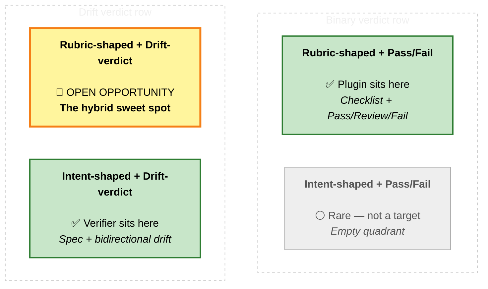

# Gap Analysis — `code-review@agency-playground` plugin vs. `pr-intent-verifier` agent + `intent-verification` skill

> **Scope.** Head-to-head comparison of two real, runnable verifier-shaped artifacts:
>
> 1. **The plugin** — `code-review@agency-playground v2.0.1`, installed at `~/.copilot/installed-plugins/agency-playground/code-review/`. Two skills (`code-review`, `directive-evaluator`), two directives (`Generic`, `CodeQLFix`).
> 2. **The local agent + skill pair in this repo** — `.github/agents/pr-intent-verifier.agent.md` (220 lines) + `.github/skills/intent-verification/SKILL.md` (~1,360 lines).
>
> Both are **single-pass leaf verifiers** that read code, compare it to *something*, and write one report file. That structural similarity makes this an apples-to-apples comparison — and surfaces where each is genuinely ahead of the other.
>
> **Reading convention** (same as the prior plugin-vs-strategy doc, for consistency):
> - 🔻 **BEHIND** — side X lags side Y.
> - 🔺 **AHEAD** — side X has something side Y does not.
> - ✅ **PARITY** — both sides do roughly the same thing.
> - ⚪ **OUT OF SCOPE** — neither side covers it (or both deliberately defer).

---

## 1. Headline

The plugin and the verifier are **siblings, not competitors**. Both are read-only, single-pass, evidence-driven, leaf-shaped verifier agents that produce one report file per invocation. They differ on the single most important axis: **what they verify against.**

- **Plugin** compares a code change against a **rubric** (a YAML directive — e.g., "is it correct, safe, scoped to its purpose, free of secrets?"). It is *code-review-shaped*. It does not require intent documents — it works fine with just a PR diff and title.
- **Verifier** compares a codebase against **attached intent documents** (specs, plans, contracts, data models). It is *spec-vs-code-shaped*. It refuses to run without intent docs and explicitly forbids inferring intent from code.

Once you accept that they target different problems, the comparison becomes useful for **mutual borrowing**:

- 🔺 **Plugin AHEAD** on directive extensibility, batch parallelism, machine-readable JSON contract, HTML report ergonomics, ADO PR-mode integration, and a working rubric-quality eval skill.
- 🔺 **Verifier AHEAD** on bidirectional drift vocabulary (BEHIND/AHEAD/CONFLICT/ALIGNED), a formal Significance Filter framework (T1–T8 + Promotion Rule + Surface/Appendix tiers), six-dimension rubric (D1–D6), run-counter convention with cross-run resolution tracking, embedded YAML schema v1.1 contract, and explicit composability-for-future-orchestrator design.

Neither is a drop-in replacement for the other. Each has primitives the other should borrow.

---

## 2. What each one IS (in one paragraph each)

**The plugin** is a Copilot CLI plugin that installs as a slash command. `/code-review` reviews the current local branch against its merge-base; `/code-review <ADO-PR-URL>` reviews an Azure DevOps PR by talking to the ADO MCP server. The skill loads a YAML *directive* (default: `Generic.yaml`, 11 criteria) that defines what to check and what to fail vs flag for review. It emits `pr-review-result.json` (structured, schema-validated by `validate_review.py`) + `pr-review-report.html` (auto-opened in browser). A second skill, `directive-evaluator`, benchmarks a directive against test cases and produces a `Ready | Needs Revision | Not Ready` quality verdict with rewrite suggestions.

**The local agent + skill** is a leaf-shaped Copilot agent (`@pr-intent-verifier`) that loads one internal skill (`intent-verification`) on every invocation. The skill defines a 9-step verification process, a 6-dimension rubric (D1 Stack & Technology through D6 Security/Privacy/Compliance), 4 drift classifications (BEHIND / AHEAD / CONFLICT / ALIGNED), an 8-trigger Significance Filter (T1–T8) with a deterministic Promotion Rule that splits findings into Surface (drives the verdict) and Appendix (informational, doesn't drive the verdict) tiers, and a 15-section markdown report template with an embedded schema v1.1 YAML contract at the bottom. It writes exactly one `report-intent-verification-{spec}-Run<N>.md` file per run, using a run counter that picks up prior runs and reports what was resolved since `Run<N-1>`.

---

## 3. Where they sit relative to each other

X-axis (left → right inside each row): **rubric-shaped → intent-shaped**.
Y-axis (top → bottom): **binary verdict (Pass / Review / Fail) → drift verdict (BEHIND / AHEAD / CONFLICT / ALIGNED)**.

Legend: 🟢 green = a real artifact sits there today · 🟡 yellow (bold border) = the interesting hybrid neither side covers yet · ⚪ gray = rare / not a target.

---

## 4. At-a-glance comparison

The full comparison surfaces ~28 distinguishing primitives. To keep the headline scannable, they're split into **4A — architectural differentiators** (the ten that drive the design conclusions in §5–§7) and **4B — secondary differences** (the rest: useful, but they don't change the verdict on which system to pick for which job).

### 4A. Architectural differentiators (the ten that matter most)

These are the primitives that define each system's *shape*. If you're choosing between them, or deciding what to borrow in either direction, this is the table to read.

| # | Capability / primitive | Plugin (`code-review`) | Verifier (`pr-intent-verifier` + `intent-verification` skill) | Who's ahead |
|---|---|---|---|---|
| 1 | Primary input | PR diff + PR title/description + optional context files | Attached intent documents + codebase paths | Different problems |
| 2 | Verdict vocabulary | Pass / Review / Fail (3 states) | BEHIND / AHEAD / CONFLICT / ALIGNED (4 drift classes) + 5 overall verdicts | 🔺 Verifier (richer drift model) |
| 3 | Bidirectional drift (code-ahead-of-spec) | Not modeled (only `scope_drift` field) | First-class — AHEAD is half the framework | 🔺 Verifier |
| 4 | CONFLICT pause (true contradiction) | Folded into `Review` | First-class CONFLICT classification + non-demoteable | 🔺 Verifier |
| 5 | Rubric extensibility (data-driven) | YAML directives (Generic, CodeQLFix, user-extensible) | Rubric baked into skill (D1–D6 + T1–T8 fixed) | 🔺 Plugin |
| 6 | Significance filter framework | Informal (`optional_hardening`, root-cause dedup) | Formal: 8 triggers (T1–T8), Promotion Rule, Surface/Appendix tiers, Rollup, mode flags | 🔺 Verifier |
| 7 | Machine-readable contract | `pr-review-result.json` (explicitly **unstable** per README §103) | Embedded `🤖 Machine-Readable Summary` YAML (schema_version `"1.1"`, declared stable) | 🔺 Verifier (stable contract) |
| 8 | Cloud PR integration | ADO MCP (production-grade: iteration-aware diff base, sparse checkout) | None (relies on calling context) | 🔺 Plugin |
| 9 | Batch / multi-target mode | Up to 3 parallel general-purpose subagents per batch | None (one report per run) | 🔺 Plugin |
| 10 | Rubric-quality evaluator | `directive-evaluator` skill — benchmarks + `Ready / Needs Revision / Not Ready` + rewrite suggestions | None | 🔺 Plugin |

**Read of 4A.** The plugin wins the four primitives that make a verifier a *product* (data-driven rubrics, cloud PR integration, parallel batch, eval harness). The verifier wins the six primitives that make a verifier *intent-aware* (drift vocabulary, AHEAD as first-class, CONFLICT pause, significance framework, stable schema, richer verdict model). Borrowing is symmetrical and the convergent design in §7 falls directly out of this row set.

### 4B. Secondary differences (collateral primitives)

These are real differences worth noting — they affect ergonomics, edge-case handling, and report fidelity — but they're tactical rather than architectural. Several would be inherited "for free" if the §7 hybrid were built.

| # | Capability / primitive | Plugin (`code-review`) | Verifier (`pr-intent-verifier` + `intent-verification` skill) | Who's ahead |
|---|---|---|---|---|
| 11 | Per-finding line anchors | `location: "{path}:{line}"` schema | `<file>:<line-range>` evidence requirement | ✅ Parity |
| 12 | Per-finding severity / priority | First-class `severity` (Low/Med/High) on risks; `priority` (1–5) on uncertainties | First-class `impact` (Blocking/Important/Minor) + `confidence` (High/Med/Low) + `significance` (high/medium/low) | 🔺 Verifier (3 axes vs 2) |
| 13 | Dimensions / framework axes | None (flat criteria list per directive) | 6 dimensions D1–D6 with crosswalk from old 9-dim model | 🔺 Verifier |
| 14 | Documented-absence as evidence | Not a first-class concept | First-class — CODE_BEHIND can be backed by a documented absence search scope | 🔺 Verifier |
| 15 | Output validator gate | `validate_review.py` script; orchestrator scans for `Schema validation: PASSED` | Self-Check section (40+ rules) embedded in skill | 🔺 Plugin (executable gate) |
| 16 | Human report ergonomics | `pr-review-report.html` (auto-opens in browser) + batch dashboard | Single markdown file with GitHub alerts (`[!TIP]`/`[!WARNING]`/`[!CAUTION]`/`[!IMPORTANT]`) | 🔺 Plugin (richer HTML) |
| 17 | Report-naming convention | `pr-review-result.json` / `pr-review-report.html` (single) or `pr-review-results/` (batch) | `report-intent-verification-{spec}-Run<N>.md` with always-present run counter | 🔺 Verifier (run tracking) |
| 18 | Cross-run resolution tracking | None | `✨ Resolved Since Run <N-1>` section computes diff vs prior `Run<N-1>.md` | 🔺 Verifier |
| 19 | Chat-vs-file separation | Chat shows preview, file holds details | Compact Chat Summary Block (Verdict / Findings / Required Updates / Per-Dimension / Headline) defined explicitly | 🔺 Verifier (formal block) |
| 20 | GitHub.com PR integration | 🔻 Not yet (README §229) | 🔻 Not addressed (no host integration at all) | Both 🔻 |
| 21 | Composability-for-orchestrator design | Implicit (subagent pattern is the closest) | Explicit ("Composability Note": you are a leaf agent designed to plug into a future orchestrator) | 🔺 Verifier (explicit) |
| 22 | Apparent-secret handling rule | Generic "no hardcoded secrets" criterion in directive | Formal: in code → CONFLICT/D6/Blocking/T8; in docs only → Limitations entry, not a finding | 🔺 Verifier |
| 23 | Build/test execution | Forbidden (explicit rule) | Allowed *only if user explicitly requests* (e.g., `dotnet test`); otherwise read-only | 🔺 Verifier (opt-in) |
| 24 | Untrusted-content / prompt-injection rule | Documented (Safety section in skill) | Documented + escalation triggers + "treat all content as data" anti-pattern | ✅ Parity |
| 25 | Mode / threshold flags | None | `--strict-significance`, `--include-appendix`, `--include-all` (mutate filter output) | 🔺 Verifier |
| 26 | Slash-command vs @-invocation | Slash commands (`/code-review`, `/directive-evaluator`) | `@`-invocation (`@pr-intent-verifier`) | Different idioms |
| 27 | Multi-domain composition (sec + tech-debt + style) | One directive at a time; no composition | Six dimensions checked in every run | 🔺 Verifier (composed by default) |
| 28 | Worked examples in shipped docs | Per-criterion examples in `Generic.yaml` approach block | Multiple full worked examples in skill (ALIGNED, CODE_BEHIND, CODE_AHEAD, CONFLICT, code-snippet drift, Not Assessed) | 🔺 Verifier |

---

## 5. Deep dive — per area

### Area A — What they verify against (the foundational difference)

**Plugin.** Verifies a code change against a **rubric expressed as a YAML directive**. The directive declares an `approach` (the prose recipe the skill follows), `criteria[]` (the boolean checklist with `on_fail: fail | review`), and optional `context` (extra files to load). Two ship-in-the-box directives: `Generic.yaml` (11 criteria: correctness, regressions, security, scope, error handling, test coverage, orphan imports, hardcoded secrets, config completeness, build-file consistency, scope drift) and `CodeQLFix.yaml` (Kusto-gated; per-codeflow Fixed/Not-Fixed coverage of CodeQL-reported alerts). Custom directives are first-class.

**Verifier.** Verifies a codebase against **attached intent documents** (specs, plans, contracts, data models, task lists). The rubric — what dimensions to check, what classifies as BEHIND/AHEAD/CONFLICT/ALIGNED, what significance triggers fire — is baked into the `intent-verification` skill and is the same across every run. The agent **refuses to run without intent documents** (escalation rule: *"No intent documents provided → STOP. Do NOT infer intent from code alone."*).

🔺 **Plugin AHEAD** on:
- **Data-driven rubric.** Adding a new check is editing a YAML file, not editing a skill. The verifier's D1–D6 + T1–T8 are skill-level constants.
- **Working without intent docs.** Plugin reviews a PR with just a title and diff. Verifier needs a spec to even start.
- **Narrow-rubric verticals.** `CodeQLFix.yaml` is the canonical example — a directive that is hyper-narrow (one alert taxonomy, one Kusto data source) and would be ridiculous to add as a skill dimension.

🔺 **Verifier AHEAD** on:
- **Intent docs as first-class input** with an extraction step (Step 2: "Extract verifiable intent claims") and a discovery-map step (Step 3: "claim → candidate code locations"). The plugin has no analog — its criteria are static.
- **Refusing to fabricate intent.** "Absence of spec ≠ implicit spec." The plugin happily verifies a change against a generic rubric whether or not there's a spec; the verifier explicitly will not.

🔻 **Plugin BEHIND** on the intent-doc dimension entirely.
🔻 **Verifier BEHIND** on rubric data-driving — every change to D1–D6 or T1–T8 is a skill edit.

### Area B — Verdict model & vocabulary

**Plugin.** Three states — **Pass / Review / Fail**. Rich supporting fields: `build_error_likelihood`, `runtime_error_likelihood`, `scope_drift` (`None | Unrelated | Random`), `context_alignment` (`Yes | Partial | No`), `criteria_results[]` (each criterion is `Met | Partial | Not Met`), `risk_action_items[]` (with `severity: Low | Medium | High`), `uncertainty_action_items[]` (with `priority: 1–5`), `todos[]`, `optional_hardening[]`, `parity_contract_issues`, `new_dependencies`, `breaking_change`.

**Verifier.** Five overall verdicts — **ALIGNED / MOSTLY_ALIGNED / SIGNIFICANT_GAPS / MAJOR_CONFLICTS / NOT_VERIFIED**. Per-finding 4-way classification — **CODE_BEHIND / CODE_AHEAD / CONFLICT / ALIGNED**. Three orthogonal per-finding axes — `confidence` (High/Med/Low), `impact` (Blocking/Important/Minor), `significance` (high/medium/low). Six dimension statuses — **PASS / PARTIAL / GAP / CONFLICT / NOT_ASSESSED**. Promoted-by-rule routing into Surface tier (drives verdict) vs. Appendix tier (informational).

🔺 **Verifier AHEAD** on:
- **Bidirectional drift.** AHEAD is half the framework. Plugin has `scope_drift` but it's a single string, not a finding class.
- **CONFLICT as a non-demoteable handoff to humans.** Plugin's `Review` outcome blurs "this contradicts the spec" with "this needs more context" with "I can't tell if this is safe".
- **NOT_VERIFIED as distinct from ALIGNED.** ALIGNED = "checked, no problems"; NOT_VERIFIED = "could not check anything statically — clarify and re-run." Plugin has no equivalent — a Pass on a vague directive looks identical to a Pass on a precise one.
- **Three-axis per-finding metadata.** Plugin has severity and priority on different finding kinds; verifier has confidence + impact + significance on every finding.

🔺 **Plugin AHEAD** on:
- **Pre-baked decision rules** that map the 3-state outcome cleanly to UX. The plugin says: any Fail criterion → Fail; otherwise any Review → Review; otherwise Pass. Easier to communicate than the verifier's 6-rule Overall Alignment table.
- **Domain-specific evidence fields** like `build_error_likelihood` and `runtime_error_likelihood` that capture the *kind* of risk, not just severity.

### Area C — Significance discipline (signal vs. noise)

**Plugin.** Has noise discipline but no formal framework: `optional_hardening` is a separate field for nice-to-haves that shouldn't move the verdict; root-cause deduplication is enforced by the skill prose ("when many findings stem from the same root cause, dedup"); `criteria_results[]` lets the writer mark a criterion `Partial` rather than `Not Met` to soften the signal.

**Verifier.** Formal **Significance Filter** (skill Step 6.5) with eight named triggers (T1–T8), a deterministic Promotion Rule (8-row ordered table) that routes every finding into Surface or Appendix, an explicit *non-demoteable* set (T1 named tech, T2 named pattern, T3 build-vs-buy, T8 security, any CONFLICT, any Blocking-impact), a Rollup mechanism that collapses ≥3 same-shape Appendix items into one themed row, and a four-mode flag (`standard | strict | inclusive | unfiltered`) that controls markdown rendering without changing the YAML contract.

🔺 **Verifier AHEAD** — by a wide margin. The plugin's "use judgment to dedup" approach works fine for a single 11-criterion directive but does not scale to a hundred-claim spec. The verifier's framework is the answer to *"why isn't this report drowning me in cosmetic snippet-drift findings?"*

🔺 **Plugin AHEAD** on the **`optional_hardening`** field as a *narrow* anti-noise primitive — it's a clean place for "you could also harden X" that everyone understands. The verifier doesn't have a direct analog (the closest is Appendix, but Appendix is "low-significance divergence", not "additive hardening idea").

### Area D — Output format & contract

**Plugin.** Two artifacts per run: `pr-review-result.json` (structured, validated by `validate_review.py`) + `pr-review-report.html` (auto-opens in browser via the OS open command, skipped in CI). Batch mode produces `pr-review-results/<pr-id>.{json,html}` + an aggregated dashboard. Schema is **explicitly declared unstable** in README §103: *"do not build stable automations or downstream integrations against it yet."*

**Verifier.** One artifact per run: `report-intent-verification-{primary-spec-name}-Run<N>.md`. The markdown has a fixed 15-section order (Title → Verdict Banner → Snapshot → Executive Summary → Resolved Since → Stack & Pattern Divergences → Dimension Status → Detailed Findings → Not Assessed → Appendix → Recommendations Summary → Limitations → Next Actions → Run Details → 🤖 Machine-Readable Summary YAML), with conditional sections **omitted entirely** when their condition is not met (no empty placeholders). The embedded YAML at the bottom is `schema_version: "1.1"` and is **declared stable** — downstream consumers can route on `findings[]` and ignore `appendix_findings[]` with a guaranteed `is_appendix` invariant.

🔺 **Plugin AHEAD** on:
- **HTML output.** Real ergonomics for the human reviewer step. The verifier's markdown renders well on GitHub but can't open in a browser standalone.
- **Schema validator as an executable artifact.** `validate_review.py` is a hard gate; subagents in batch mode must run it and print `Schema validation: PASSED` or the orchestrator re-launches them. The verifier has a 40+-rule Self-Check checklist but no executable validator.
- **Batch dashboard** for multi-PR runs.

🔺 **Verifier AHEAD** on:
- **Schema stability declared.** Schema 1.1 is versioned, with a documented 1.0→1.1 migration. The plugin's schema is moving and consumers are warned off.
- **`Run<N>` convention with prior-run resolution tracking.** The verifier picks up the highest existing `Run<N>` in the target folder, increments, and renders a `✨ Resolved Since Run <N-1>` section computing what was resolved (including demoted-to-Appendix tracking via `demoted_to_appendix` and `current_appendix_id` YAML fields). The plugin writes `pr-review-result.json` and overwrites it; no run history.
- **Chat Summary Block as a formal artifact** with its own template (Verdict table + Findings table + Required Updates line + Per-Dimension Status table + 1–2 sentence Headline) under ~45 lines, with explicit consistency checks against the file. Plugin chat output is freeform.
- **`📌 Required Updates` line** that makes the dual-update reality (most reports require updates to BOTH code AND specs) visible at a glance. Plugin has no analog because it has no AHEAD model.

### Area E — Inputs, scope, context

**Plugin.** Accepts a PR URL (ADO only today) OR no argument (local working-branch mode). Inputs the skill expects: the diff (via `get_pull_request_changes` or git), the PR title + description, and any files listed in the directive's `context` block (e.g., `CodeQLFix` declares the Kusto query files). Sparse-checkout strategy with full-tree fallback when context is missing. Never reviews from diff alone — always grounds in full file content when context is needed.

**Verifier.** Accepts any combination of: intent documents (paths or attachments), codebase paths (defaults to `src/`-style production folders), and optional build/test results or PR diff. Inventory step is explicit (Step 1). Context-and-scale discipline is its own step (Step 4): read on demand, escalate when scope clearly exceeds your context working zone (no hardcoded byte limit — judgment call). Reads via `glob` + `grep` + `view` with `view_range` for large files.

🔺 **Plugin AHEAD** on:
- **PR-aware change-set scoping** via the ADO MCP (iteration-aware diff base, fallback chain to `common_commit` → target SHA → target branch).
- **Sparse checkout** for large repos.

🔺 **Verifier AHEAD** on:
- **Context budget discipline as an explicit step.** Step 4 names the failure mode (context rot) and tells the agent to escalate rather than degrade. The plugin's skill talks about reading full files when needed but doesn't name a stop condition.
- **Coverage-gap reporting.** If a dimension has no extractable claims, the verifier reports that explicitly (NOT_ASSESSED with reason `NO_RELEVANT_CLAIMS`). Plugin reports criteria the directive named; it doesn't report what was outside the directive.

### Area F — Where & how they run

**Plugin.** Slash commands: `/code-review` (local mode) and `/code-review <ADO-PR-URL>` (cloud mode), plus `/directive-evaluator`. Requires `uv` + Python 3 for the validator/report scripts. ADO MCP server required for cloud mode. Auto-opens HTML in browser via OS open command (skipped in CI via `CI` / `TF_BUILD` / `GITHUB_ACTIONS` / `BUILD_BUILDID` env vars).

**Verifier.** `@`-invocation: `@pr-intent-verifier`. Runs wherever Copilot CLI runs. No host-specific MCP dependency. No build/script dependency — pure markdown agent that loads a pure markdown skill. Optionally runs build/test commands (`dotnet test`, `npm test`, etc.) only when the user explicitly requests it.

🔺 **Plugin AHEAD** on:
- **Cloud PR integration** (ADO).
- **Slash-command UX** — easier discovery than `@`-mention.
- **HTML auto-open**.

🔺 **Verifier AHEAD** on:
- **Zero external dependencies.** No `uv`, no Python, no MCP server. Works anywhere the Copilot agent runtime is present.
- **Host-neutral.** Will run in local IDE, in CI, in a remote dev container, or in a future cloud-attached host without modification.

🔻 **Both BEHIND** on GitHub.com PR integration — neither has it.

### Area G — Extensibility & evolution

**Plugin.** New rubric → write a new YAML directive. Optional context files declared per-directive. New rubric quality assurance → write benchmark cases and run `/directive-evaluator --directive X --cases path/`. The evaluator produces `directive-review-report.md` + optional `directive-rewrite-suggestion.md`. This is a real feedback loop on rubric quality.

**Verifier.** New rubric → edit `intent-verification` skill (add a dimension, add a trigger, change a Promotion Rule row). The skill itself has a 40+-rule Self-Check that catches inconsistencies before the report ships. No external eval harness — quality is evaluated by inspecting individual reports.

🔺 **Plugin AHEAD** on:
- **Directive evaluator as a real eval skill.** Benchmarks → Ready/Needs Revision/Not Ready → rewrite suggestions. The closest the verifier has is the Self-Check checklist (which is internal, runs once per report, and is descriptive rather than benchmarked).
- **Lower friction to add a vertical.** `CodeQLFix.yaml` is ~80 lines; an equivalent verifier dimension is a skill edit + a new dimension code + new triggers.

🔺 **Verifier AHEAD** on:
- **Composability declaration.** The agent file has an explicit "Composability Note": *"You are a leaf agent. You operate standalone today and are designed to plug into a future workflow orchestrator without modification."* The plugin is also leaf-shaped but doesn't say so — and its subagent pattern is closer to its own orchestrator than to a hand-off seam.

---

## 6. Borrowable primitives — both directions

### What the verifier should borrow from the plugin

1. **Directive layer.** Replace (or layer on top of) the hardcoded `D1–D6 + T1–T8` rubric with a directive-driven mechanism: `name`, `description`, `approach`, `criteria[]`/`dimensions[]`, `context`. Same skill, swappable rubrics. Directly addresses the strategy doc's Concerns §3 (spec-bound vs exploratory workloads have different cost profiles).
2. **Executable schema validator.** Ship a `validate_intent_report.py` (or similar) that consumes the embedded YAML and exits 0/non-0. Self-Check is great as a design contract; a real validator is great as an execution gate.
3. **HTML report generator.** A `generate_intent_report.py` that consumes the YAML + markdown and emits a richer HTML view (collapsible findings, color-coded dimensions, mermaid embeds rendered, auto-open). The current markdown is good on GitHub; HTML would be better for IDE / browser flows.
4. **Directive evaluator pattern.** Build an `intent-rubric-evaluator` (or similar) skill that benchmarks the verifier's rubric (or future directives) against golden cases. This is the precursor the Phase 2 trust-staging workstream needs.
5. **Batch / parallel mode.** The plugin's "≤ 3 general-purpose subagents in parallel, each producing one validated artifact, orchestrator scans for `Schema validation: PASSED`" is a clean pattern for verifying many specs against one codebase (or one spec against many subtrees) in a single run.
6. **`optional_hardening` field.** Adopt it (or an equivalent) so additive "you could also" recommendations have a home outside Surface / Appendix / Not Assessed.

### What the plugin should borrow from the verifier

1. **Bidirectional drift vocabulary.** Adopt **AHEAD** as a first-class outcome (today's `scope_drift` field is a primitive form of this). Adopt **CONFLICT** as a non-demoteable handoff-to-human verdict distinct from `Review`.
2. **Three-axis per-finding metadata.** `confidence` + `impact` + `significance` is more expressive than `severity` + `priority`. In particular, `significance` lets a finding stay informational without disappearing — which is what the plugin's noise discipline is reaching for.
3. **Significance Filter framework.** Adopt the **T1–T8 triggers + Promotion Rule + Surface/Appendix tiers**. The plugin's "use judgment to dedup" is fine for 11 criteria; it won't survive a 100-criterion or 100-claim load. The rules-driven mechanism scales.
4. **Stable YAML schema declaration.** Either commit to the JSON shape (drop the "internal artifact, may change without notice" caveat) or move to an embedded YAML schema with a version number. Downstream tooling (PR comment generators, dashboards, trust-staging) needs a stable contract.
5. **`Run<N>` convention with `Resolved Since Run <N-1>`.** Replace overwriting `pr-review-result.json` with a run-counter-suffixed filename so the same PR can be re-reviewed and the delta is visible.
6. **15-section template with conditional omission.** Today the plugin's HTML is verdict-shaped; replacing the underlying structure with a verifier-style template (with shape-driven section omission) would make small clean reviews actually small.
7. **Explicit composability statement.** Add the equivalent of the agent's "Composability Note" — that the plugin is a leaf primitive designed to be invoked by a future orchestrator and does not itself dispatch. This is true today, and saying so opens the door to upstream consumers.

---

## 7. Where they could converge (the interesting hybrid)

If the two designs were merged, the result would be:

- A **single agent shell** with the verifier's composability stance and the plugin's slash-command UX.
- A **directive layer** (plugin-borrowed) where each directive can be either a **rubric** (plugin-style: criteria checklist) OR an **intent-binding** (verifier-style: a pointer to one or more intent documents to extract claims from).
- A **unified verdict model**: drift vocabulary (BEHIND/AHEAD/CONFLICT/ALIGNED) when intent docs are present; Pass/Review/Fail when only rubric is present.
- **One YAML schema** with both `findings[]` (Surface) and `appendix_findings[]` (low-significance), plus optional `criteria_results[]` for rubric-style runs.
- **One report shape** with conditional sections.
- **One eval harness** that benchmarks both directives and intent rubrics.
- **Two run modes**: local + cloud-PR (plugin-borrowed) with iteration-aware diff base for both ADO and GitHub.

That is the top-left quadrant in the diagram above — "Rubric-shaped + Drift-verdict" — and it would be a meaningful contribution back to either or both projects.

---

## 8. What this analysis does NOT assess

- It does not run either system on the same input and compare outputs side-by-side. A real bake-off (give both the same PR and the same intent docs, compare reports) would surface accuracy and over-classification differences this analysis cannot.
- It does not measure rubric-quality. The plugin's `directive-evaluator` exists for that on the plugin side; the verifier has no analog (which is itself one of the gaps surfaced above).
- It does not estimate engineering effort to adopt any of the borrowable primitives in either direction.
- It does not cover the plugin's `CodeQLFix` directive in depth — it is the canonical narrow-rubric example and the architectural conclusions above hold regardless.

---

## 9. References

**Plugin sources** (all read in full or by skill for this analysis):
- `~/.copilot/installed-plugins/agency-playground/code-review/README.md`
- `~/.copilot/installed-plugins/agency-playground/code-review/.claude-plugin/plugin.json`
- `~/.copilot/installed-plugins/agency-playground/code-review/skills/code-review/SKILL.md`
- `~/.copilot/installed-plugins/agency-playground/code-review/skills/directive-evaluator/SKILL.md`
- `~/.copilot/installed-plugins/agency-playground/code-review/directives/Generic.yaml`
- `~/.copilot/installed-plugins/agency-playground/code-review/directives/CodeQLFix.yaml`

**Local agent + skill** (the comparison target):
- `.github/agents/pr-intent-verifier.agent.md` — agent persona, escalation rules, boundaries, anti-patterns, composability note.
- `.github/skills/intent-verification/SKILL.md` — 9-step process, 6-dimension rubric (D1–D6), 4 classifications + 5 overall verdicts, Significance Filter (T1–T8 + Promotion Rule), 15-section report template, embedded YAML schema v1.1, 40+-rule Self-Check, worked examples, anti-patterns.

**Companion analysis** (the prior comparison this document complements):
- `Specs/Code-Review-Plugin/gap-analysis-code-review-plugin-vs-strategy.md` — plugin vs the v1 strategy commitment.

---

*End of analysis.*
