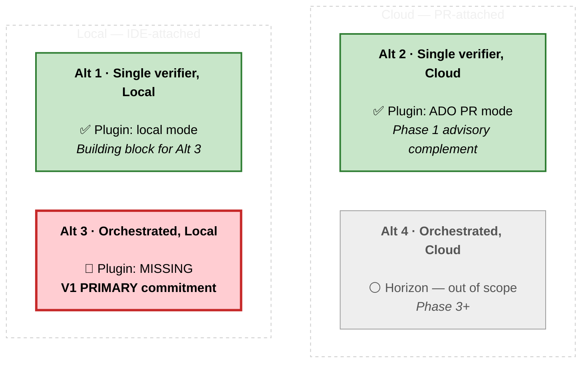
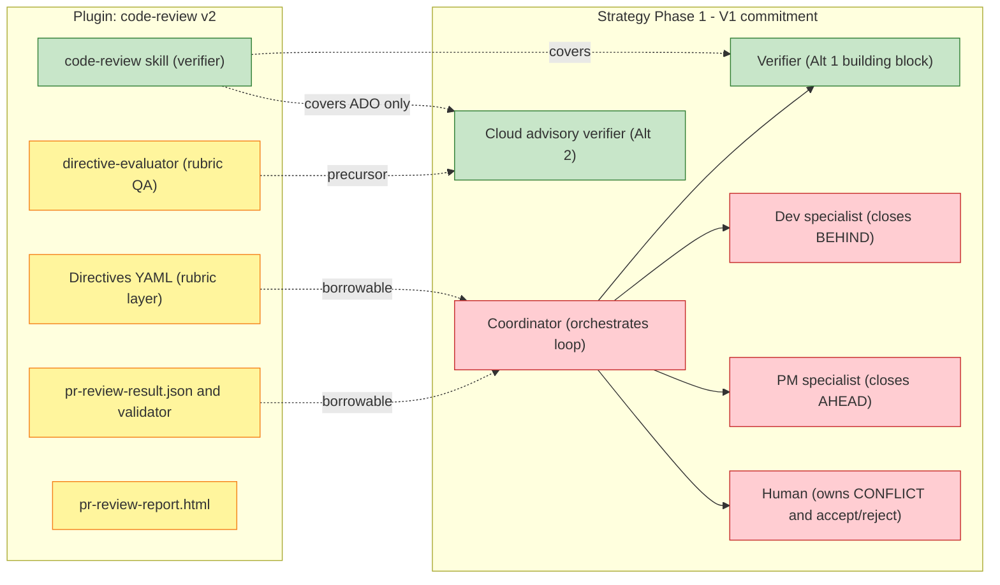

# Gap Analysis — `code-review@agency-playground` plugin vs. PR Intent Verification Strategy (Phase 1)

> **Scope.** This document compares the installed `code-review@agency-playground v2.0.1` plugin against the Phase 1 commitment described in `Specs/01-Global/02-pr-intent-verification-strategy/pr-intent-verification-strategy.md`. The goal is to be concrete about where the plugin **already covers what the strategy needs**, where it **lags behind**, and what is **out of scope by design** on either side.
>
> **Reading convention.** I borrow the strategy's own vocabulary for drift:
> - 🔻 **BEHIND** — the plugin lags what the strategy commits to in v1.
> - 🔺 **FORWARD** — the plugin already provides something the strategy could borrow, or is materially ahead of the strategy's current spec.
> - ✅ **ALIGNED** — the plugin already does roughly what the strategy needs.
> - ⚪ **OUT OF SCOPE** — explicitly not addressed by either side, or deliberately deferred.

---

## 1. Headline

The plugin is a **production-grade implementation of Alt #2 (single verifier, cloud-attached)** with a **clean local-mode that doubles as Alt #1 (single verifier, local)**. Both are exactly the alternatives the strategy uses as *the complement* and *the building block* — not as the v1 primary.

The v1 primary commitment — **Alt #3, the orchestrated multi-agent workflow running locally in the IDE** — is **not in the plugin at all**. There is no coordinator, no dev specialist, no PM specialist, no bounded iteration, no CONFLICT-pause handshake, no BEHIND/AHEAD vocabulary.

The plugin is therefore best read as:

- ✅ A drop-in candidate for the **advisory cloud verifier** half of Phase 1 (for Azure DevOps repos only).
- ✅ A working **building-block verifier** that an orchestrated coordinator could invoke.
- 🔺 A source of **borrowable design primitives** (directive model, JSON schema, validator gate, batch parallelism, HTML report ergonomics).
- 🔻 **Not** an implementation of the orchestrated local loop that the strategy bets on for v1.

---

## 2. Where the plugin sits on the strategy's alternatives matrix

X-axis (left → right inside each row): **single verifier → orchestrated workflow**.
Y-axis (top → bottom): **cloud (PR-attached) → local (IDE-attached)**.

Legend: 🟢 green = covered by plugin · 🔴 red (bold border) = plugin gap that is the v1 commitment · ⚪ gray = deferred / out of scope.

Plugin coverage in plain English:

| Strategy alternative | Strategy role in Phase 1 | Plugin coverage |
|---|---|---|
| **Alt #1** — Single verifier, local | Building block (Alt #3 wraps it) | ✅ `/code-review` local mode |
| **Alt #2** — Single verifier, cloud | **Phase 1 advisory complement** | ✅ `/code-review <ADO-PR-URL>` (ADO only) |
| **Alt #3** — Orchestrated workflow, local | **Phase 1 PRIMARY** | 🔻 None |
| **Alt #4** — Orchestrated workflow, cloud | Horizon (Phase 3+) | ⚪ Out of scope |

The plugin closes exactly the half of v1 that the strategy explicitly says is **the complement, not the bet**. The half the strategy bets on is uncovered.

---

## 3. At-a-glance mapping

| # | Strategy primitive (Phase 1) | Plugin equivalent | Verdict |
|---|---|---|---|
| 1 | Verifier (single-pass, audit) | `code-review` skill | ✅ Strong fit |
| 2 | Coordinator (iterative dispatcher) | — | 🔻 Missing |
| 3 | Dev specialist (closes BEHIND) | — | 🔻 Missing |
| 4 | PM specialist (closes AHEAD) | — | 🔻 Missing |
| 5 | Verdict vocab: BEHIND / AHEAD / CONFLICT / ALIGNED | Pass / Review / Fail | 🔻 Different model |
| 6 | Intent docs as first-class input | Implicit (PR title + diff) | 🔻 Missing |
| 7 | Bounded iteration (3 typical, 5 max) | One-shot per invocation | 🔻 Missing |
| 8 | CONFLICT pause for human decision | `Review` is informal | 🔻 Partial |
| 9 | Local-IDE primary loop | `/code-review` local mode | ✅ Fit (verifier role only) |
| 10 | Cloud advisory verifier on real PR | `/code-review <ADO-PR-URL>` | ✅ Fit (ADO only) |
| 11 | Directive-driven extensibility | YAML directives + 11-criterion Generic | 🔺 Plugin AHEAD |
| 12 | Three-state verdict (vs binary) | Pass/Review/Fail | 🔺 Plugin AHEAD |
| 13 | Stable machine-readable verdict | `pr-review-result.json` (declared unstable) | 🔺 Shape exists, contract not yet |
| 14 | Human-readable report ergonomics | `pr-review-report.html`, auto-open | 🔺 Plugin AHEAD |
| 15 | Trust calibration / eval staging | `directive-evaluator` skill | 🔺 Precursor exists |
| 16 | Trust-stage path (advisory → gating) | Advisory permanently | 🔻 Missing |
| 17 | Intent-doc parity (local ↔ cloud) | Not addressed | 🔻 Missing |
| 18 | Noise discipline / significance filter | `optional_hardening`, root-cause dedup, 3-state outcome | 🔺 Partial AHEAD |
| 19 | Multi-domain checks (sec / tech-debt / style) | Per-directive only, no orchestration | 🔻 Partial |
| 20 | Upstream intent elicitation (Phase 3) | — | ⚪ Out of scope |
| 21 | GitHub.com PR support | — | 🔻 Missing |

---

## 4. Deep dive — per area

### Area A — Verdict model & vocabulary

**Strategy.** Four classifications — **BEHIND** (code lacks what the spec describes), **AHEAD** (code adds what the spec does not), **CONFLICT** (human decision required), **ALIGNED** (agree). Drift is **bidirectional** on purpose; the strategy's whole framing is that AHEAD is the harder direction and a verifier that ignores it is incomplete.

**Plugin.** Three-state outcome — **Pass / Review / Fail** — with rich supporting fields: `build_error_likelihood`, `runtime_error_likelihood`, `scope_drift` (`None | Unrelated | Random`), `context_alignment` (`Yes | Partial | No`), `criteria_results[]` with `on_fail` semantics, `risk_action_items` with severity, `uncertainty_action_items` with priority, and a `structured_evidence.diff_table` describing behavior change rows.

🔻 **BEHIND**
- **No native AHEAD detection.** The plugin checks "is this change correct, safe, scoped to its purpose?" — not "is the code doing something the spec never asked for?". The strategy treats AHEAD as the hardest and most valuable direction; the plugin does not model it.
- **No CONFLICT primitive.** `Review` is the catch-all for "human needs to look", but it conflates "code-vs-intent contradiction" (true CONFLICT) with "evidence incomplete" (true uncertainty) with "above-and-beyond scope" (a third thing). The coordinator the strategy needs cannot route these the same way.
- **No ALIGNED as positive evidence.** A `Pass` says "no problems found"; it does not enumerate which intent claims were verified or which spec section each claim came from. Phase 2's trust calibration needs the latter.

🔺 **FORWARD**
- **Three-state verdict is richer than the binary it would be tempting to design.** It already matches the strategy's Concerns §1 ("don't treat small drifts like big ones"). The strategy could adopt `Pass / Review / Fail` directly as the surface verdict shape.
- **`scope_drift`** is already a primitive **AHEAD-ish** signal: "the change wandered outside its stated purpose". Repurpose it.
- **`context_alignment`** is already a primitive **intent-alignment** signal at the change level. Repurpose it.
- **First-class `severity` (risks) and `priority` (uncertainties)** as structured fields — never folded into prose — is exactly the noise discipline the strategy's Concerns §1 calls for.

### Area B — Loop architecture & bounded iteration

**Strategy.** Hub-and-spoke. Coordinator iterates: verifier → classify → dispatch (BEHIND→dev, AHEAD→PM, CONFLICT→pause) → re-verify → converge or escalate. Bounded to **3 typical, 5 max** iterations. The human is required only on CONFLICT and final accept/reject.

**Plugin.** **One-shot per invocation.** Single verifier emits a single verdict and stops. Re-running is human-driven. No coordinator, no iteration state, no specialist dispatch, no convergence logic.

🔻 **BEHIND**
- This is the strategy's largest delta. The plugin implements precisely the alternatives the strategy calls out as **incomplete** (Alt #1 and Alt #2): *"the verifier itself is single-pass and stateless; the multi-loop pain is human-driven"* (§6.1).
- No bounded-iteration discipline. No cap, no convergence test, no escalation path.
- No specialist routing. The plugin's `todos[]` field is informational — nothing acts on it.

🔺 **FORWARD**
- The plugin's **`pr-review-result.json` is a clean, machine-readable verdict shape a coordinator could consume as input**. The strategy does not yet have a production verdict schema; the plugin's is a useful starting point (modulo additions for AHEAD/CONFLICT).
- The plugin's **`criteria_results[]` with `on_fail: fail | review` semantics is a dispatch-ready signal**. A coordinator could route `Not Met + on_fail: fail` to a dev specialist automatically, and `Not Met + on_fail: review` to a human or PM specialist. This is the missing primitive the coordinator needs — and the plugin already has it.

### Area C — Specialist roles (hub-and-spoke)

**Strategy.** Five roles: verifier, coordinator, dev specialist (closes BEHIND), PM specialist (closes AHEAD), human (owns CONFLICT and final accept/reject).

**Plugin.** **One role only — verifier.** Produces a verdict and stops.

🔻 **BEHIND**
- No coordinator (the strategy says this is *"the alternative that has the most novel surface area to get right"* — §6.3).
- No dev specialist agent.
- No PM specialist agent.
- No structured "human decision capture" primitive (just JSON + HTML for human reading).

🔺 **FORWARD**
- The plugin's **batch-PR-review subagent pattern** is, in miniature, exactly the multi-agent orchestration shape a coordinator needs: spawn ≤ 3 general-purpose subagents in parallel, each receives the full directive and schema, each writes exactly one validated JSON file, orchestrator enforces a validation gate by scanning each subagent's final message for the string `Schema validation: PASSED` and re-running the validator if it's missing.
- This pattern is borrowable wholesale. It is a working answer to: *"how does an orchestrator dispatch work to specialists, enforce a contract on their output, and react when the contract is violated?"* — which is exactly the coordinator's job in Phase 1.

### Area D — Where it runs (local IDE vs. cloud PR)

**Strategy.** Phase 1 commits to **local IDE primary** + **narrow advisory cloud verifier** on the pushed PR. The two are complements: local carries iteration cheaply because the developer is co-present; cloud catches what escaped between local "done" and the pushed branch.

**Plugin.** Both modes exist in one skill. `/code-review` = local working-branch mode. `/code-review <ADO-PR-URL>` = cloud PR mode via the ADO MCP server. Same directive layer, same JSON schema, same HTML report.

🔻 **BEHIND**
- **No GitHub.com PR support.** Plugin README §229 is explicit: *"Not yet. This plugin currently documents Azure DevOps PR review and local branch review."* The strategy is platform-neutral; the plugin is ADO-locked for the PR-mode half.
- **No "candidate changeset" abstraction.** Local mode reviews "HEAD vs default branch merge-base". It does not recognize staged-but-uncommitted edits, draft PRs, or an agent's working tree as first-class changeset types — which the strategy explicitly does (§7.2.1).
- **No intent-doc parity model.** The plugin reads the diff and PR description. It does not know which intent docs the developer was iterating against locally vs. which intent docs are on the PR branch. This is precisely Concerns §5 and the plugin offers no closure for it.

🔺 **FORWARD**
- The ADO PR-mode wiring is **production-grade**: merge-base via `commonRefCommit.commitId` from the last iteration; iteration-aware diff base with fallback chain (`common_commit` → target SHA → target branch); sparse-checkout strategy for large repos with full-tree fallback when context is missing; never reviews from diff alone. This is the Alt #2 implementation the strategy can lift wholesale (for ADO).
- **Local mode and cloud mode in one skill with one schema** is itself a prototype of the **host-neutral adapter** the strategy's Phase 2 platform-architecture workstream calls for. The seam already exists.

### Area E — Adoption motion & trust

**Strategy.** Opt-in. Advisory. No enforcement in v1. Trust calibration explicitly deferred to Phase 2 (advisory → conditionally gating → broadly gating, backed by evaluation pipelines).

**Plugin.** Opt-in. Advisory by design — the `Review` outcome explicitly means "needs human follow-up" and the README distinguishes it from `Fail`. No merge gate.

🔻 **BEHIND**
- **No trust-staging workflow defined.** Plugin is permanently advisory by its current shape — there is no documented path to graduate to gating.
- **No telemetry / aggregation layer.** Verdicts are written to disk and shown in chat. No quality measurement over time, no per-criterion accuracy tracking, no advisory-vs-actual reconciliation.
- **JSON output explicitly declared unstable** (README §103: *"do not build stable automations or downstream integrations against it yet"*). The strategy's Phase 2 needs a stable verdict schema to build the platform layer on.

🔺 **FORWARD**
- The **`directive-evaluator` skill is a working precursor to trust-staging.** It tests a directive against benchmark cases and produces a readiness verdict (`Ready | Needs Revision | Not Ready`) with per-criterion clarity / observability / calibration analysis, false-pass and false-fail pattern detection, and concrete rewrite suggestions. That is structurally what the strategy's Phase 2 trust-staging needs — at directive-level today, at platform-level if promoted.
- The plugin's `directive-rewrite-suggestion.md` output is an early example of the system improving its own quality signal — exactly the kind of feedback loop a trust-staging workflow rests on.

### Area F — Directive / extensibility model

**Strategy.** Largely silent on this. The verifier's rubric (6 dimensions, classification rules, 8 significance triggers) is **baked into the verifier skill** (`.github/skills/intent-verification/SKILL.md`). The rubric is not data-driven.

**Plugin.** **Directive-driven by data, not by skill code.** A directive is a short YAML file with `name`, `description`, `approach`, `criteria[]` (each `{text, on_fail}`), and optional `context`. Ships two built-in directives (`Generic` with 11 criteria, `CodeQLFix` with codeflow-coverage logic). User-extensible without touching the skill.

🔺 **FORWARD** (this is the biggest place the plugin is ahead of the strategy)
- **Clean separation of *what to check* (data) from *how to check* (skill).** The strategy currently hardcodes the rubric. A directive layer would let the same verifier run **different rubrics for different workloads** — directly addressing strategy Concerns §3 (spec-bound vs. exploratory workloads have different drift cost profiles, and a one-size rubric will annoy one of them).
- **The directive `context` field declares what extra files to load.** That is the seam to inject intent docs as first-class input without modifying the verifier skill.
- **The `criteria[].on_fail` field (`fail` vs `review`)** is the routing signal a coordinator needs to distinguish "BEHIND finding we can dispatch automatically" from "CONFLICT that requires a human".
- **The directive evaluator (`directive-evaluator`)** closes the loop on directive quality — Phase 2 trust calibration in early form, at the rubric layer.

🔻 **BEHIND**
- Directives are PR-review-shaped, not intent-verification-shaped. They check "is this change correct/safe/scoped" — they do not natively express "extract claims from this plan file and verify each one against the diff". Adapting them is mechanical, but not free.
- **No directive composition or inheritance.** Every directive is flat. The strategy's "broader multi-domain checks" open candidate (§7.5) wants a security directive + a tech-debt directive + a style directive running together — the directive layer would need composability the plugin does not yet offer.

### Area G — Reporting, artifacts, schema

**Strategy.** Implicit — the verifier skill produces an *Intent Verification Report* file with a structured markdown template + a machine-readable YAML block at the bottom.

**Plugin.** `pr-review-result.json` (structured) + `pr-review-report.html` (rich, auto-opens in the browser). Per-finding `location: "{path}:{line}"` explicitly designed for downstream PR-comment line-anchoring. Batch dashboard when multiple PRs are reviewed together.

🔺 **FORWARD**
- **HTML report opens in the browser automatically** — a polish the strategy's verifier doesn't yet specify, and an important ergonomics win for the human-in-the-loop step.
- **Batch dashboard** for multi-PR runs is a primitive the strategy will need for Phase 2's repository-wide trust-calibration story (aggregate verdicts across many PRs).
- **Schema validator (`validate_review.py`)** that gates output before downstream consumption is a working example of the schema-stability discipline Phase 2 platform-architecture needs. Subagents must run it; orchestrator scans for `Schema validation: PASSED`; failures re-launch the agent with the validator's error output appended.
- **`location: "{path}:{line}"`** is explicitly designed as the seam between a cloud verdict and a PR-system rendering layer.

🔻 **BEHIND**
- HTML report is **verdict-centric, not intent-claim-centric.** No per-intent-claim traceability (no "plan §4.2 claim X → code line Y, ALIGNED").
- JSON schema is explicitly **unstable today** — the platform layer the strategy needs cannot yet be built on top of it.

### Area H — Out of scope (both sides) and one-side-only

| Item | Strategy stance | Plugin stance |
|---|---|---|
| Upstream intent elicitation (Phase 3) | Deferred — horizon | Not addressed |
| Multi-domain checks (security / tech-debt / style) | Open candidate, deferred (§7.5) | Per-directive only; no cross-directive orchestration |
| Codebase-grounding digests | Open candidate, deferred (§7.5) | Not addressed |
| GitHub.com PR support | Implied target | 🔻 Not yet supported |
| Build / runtime verification | Out of scope (static analysis) | Out of scope (explicit rule: *"Do NOT build the code or run tests"*) |

---

## 5. Summary of where each piece lives

Legend: 🟢 green = covered by plugin · 🔴 red = plugin gap (the strategy's v1 novel work) · 🟡 yellow = plugin primitive that the strategy can borrow.

---

## 6. Recommendations

1. **Borrow the directive model into the v1 verifier.** Today the verifier's rubric is baked into `.github/skills/intent-verification/SKILL.md`. Replacing it (or layering on top of it) with a directive-driven layer ships value immediately and directly addresses strategy Concerns §3 (different rubrics for different workloads).

2. **Borrow the structured JSON schema + the `validate_review.py` gate pattern** as the seed for the strategy's Phase 2 stable verdict contract. Extend it with the missing fields the strategy needs — `classification: BEHIND | AHEAD | CONFLICT | ALIGNED`, per-finding `intent_doc_ref`, the 6 dimensions, the 8 significance triggers — but keep the validator-as-gate discipline.

3. **Borrow the batch parallelization + orchestrator-validation pattern** wholesale as the architectural shape for the coordinator's specialist dispatch. The plugin has already solved "spawn ≤ N general-purpose subagents, enforce a contract on their output, react when the contract is violated." That is most of the coordinator's job.

4. **Borrow the HTML report ergonomics** (auto-open, line-anchored locations, structured `diff_table`) for the v1 verifier output. The plugin's polish here is real and worth not reinventing.

5. **Do not confuse the plugin with v1.** The plugin is Alt #2 + Alt #1. The strategy's bet is Alt #3 — the orchestrated local loop with coordinator, dev specialist, PM specialist, bounded iteration, and CONFLICT-pause handshake. **Closing that gap is the v1 build, and the plugin does not start it.**

6. **Treat `directive-evaluator` as the seed for Phase 2 trust-staging.** Its `Ready | Needs Revision | Not Ready` model at the directive level is structurally the calibration mechanism the strategy will need at the verifier-platform level.

7. **Plan for the GitHub.com gap.** If the strategy's first deployment targets include GitHub-hosted repos, the cloud verifier half cannot rely on the plugin as-is. Either (a) gate Phase 1 on adding GitHub PR support (upstream contribution or fork), (b) use `gh pr checkout` + plugin local mode as a workaround for early adopters, or (c) build the cloud verifier on a different substrate.

---

## 7. What this analysis does **not** assess

To be explicit about its limits, this document does not:

- Run either system end-to-end on a real changeset and compare outputs side-by-side.
- Judge the quality of the plugin's verdicts on real PRs (the plugin's own `directive-evaluator` exists for that and would be the right tool).
- Compare implementation cost of "borrow plugin primitives" vs. "build v1 from scratch" — that is an engineering planning exercise this analysis enables, not one it concludes.
- Cover the plugin's `CodeQLFix` directive in depth (it is the canonical narrow-rubric example; the architectural conclusions above hold regardless).

---

## 8. References

**Strategy:**
- `Specs/01-Global/02-pr-intent-verification-strategy/pr-intent-verification-strategy.md` — the v1 strategy document this analysis is anchored against.

**Plugin sources (read in full for this analysis):**
- `~/.copilot/installed-plugins/agency-playground/code-review/README.md`
- `~/.copilot/installed-plugins/agency-playground/code-review/.claude-plugin/plugin.json`
- `~/.copilot/installed-plugins/agency-playground/code-review/skills/code-review/SKILL.md`
- `~/.copilot/installed-plugins/agency-playground/code-review/skills/directive-evaluator/SKILL.md`
- `~/.copilot/installed-plugins/agency-playground/code-review/directives/Generic.yaml`
- `~/.copilot/installed-plugins/agency-playground/code-review/directives/CodeQLFix.yaml`

**Prior-art prototypes in this repo (referenced by the strategy's Appendix A):**
- `.github/agents/pr-intent-verifier.agent.md` — single-verifier prototype.
- `.github/agents/pr-intent-resolution-coordinator.agent.md` — orchestrated-workflow prototype.
- `.github/skills/intent-verification/SKILL.md` — verifier methodology.

---

*End of analysis.*
