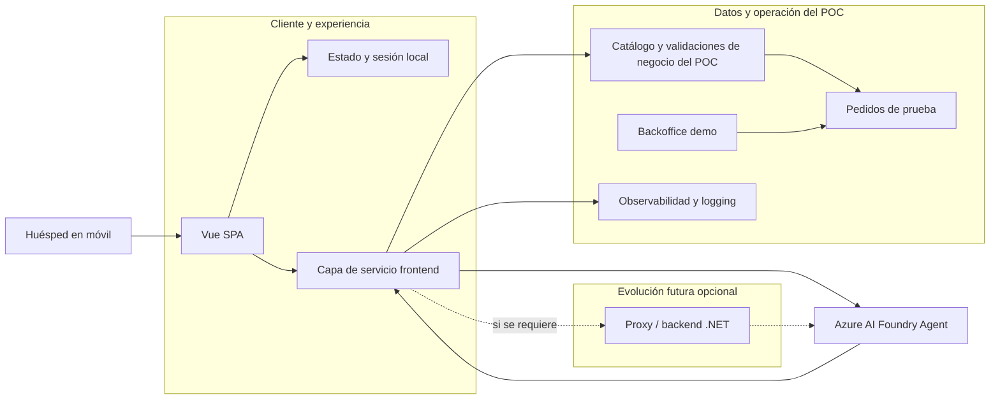

# Implementation Plan — Iberostar Restaurant Assistant

## 1. Objetivo del proyecto

Construir una aplicación web de tipo SPA en Vue que permita a un huésped interactuar con un asistente gastronómico en español e inglés para consultar la oferta del restaurante, obtener recomendaciones personalizadas, confirmar una selección y registrar un pedido de prueba en un backoffice interno.

Para esta propuesta de POC, la integración con el agente de Azure AI Foundry se realizará directamente desde la aplicación frontend en JavaScript, siempre que la configuración de seguridad del endpoint lo permita. Esta decisión responde a la necesidad de mantener el alcance del MVP ágil y evitar incorporar un backend únicamente para la demo técnica. El backend en .NET se considerará como evolución futura en una fase posterior, cuando el proyecto requiera validación de negocio centralizada, secretos más estrictos o integración con sistemas operativos reales.

---

## 2. Alcance funcional a implementar

La implementación cubrirá la fase 1 del POC definida en la especificación funcional:

- Web app compatible con móvil (responsive / PWA-like)
- Conversación por texto y voz
- Soporte en español e inglés
- Consulta de catálogo de platos, bebidas y vinos
- Recomendaciones según gustos, presupuesto y disponibilidad
- Identificación de producto por imagen/cartel o consulta textual
- Validación de datos críticos (alérgenos, ingredientes, maridajes)
- Resumen editable antes de confirmar pedido
- Registro de pedido de prueba en backoffice
- Derivación al personal cuando hay datos incompletos o críticos

Fuera de alcance en esta fase:

- Pago directo
- Integración con PMS, caja o cocina de producción
- Autenticación de huésped persistente
- Datos reales de producción
- Persistencia de audio e imágenes por defecto

---

## 3. Arquitectura propuesta

### 3.1 Visión general

La arquitectura del POC se compone de 3 capas principales:

1. Frontend Vue SPA
   - UI de conversación
   - Componentes de recomendación, resumen y backoffice operativo
   - Gestión de estado de sesión
   - Captura de voz y submit de mensajes
   - Lógica de consumo del agente desde JavaScript

2. Azure AI Foundry Agent
   - Agente del restaurante asistente
   - Diseñado para operar sobre el catálogo, maridajes, vinos y negocio del restaurante
   - Consumido directamente desde la web app a través del endpoint de OpenAI Responses

3. Data and operational layer
   - Catálogo digital del restaurante
   - Estado de disponibilidad
   - Pedidos de prueba
   - Logging y observabilidad mínima

> En el POC no se incluirá un backend dedicado exclusivamente para la integración con el agente. La decisión es intencional: la demostración funcional debe centrarse en la experiencia del usuario y en la conexión con Azure Foundry sin añadir una capa de infraestructura que no aporte valor en esta fase. Un backend en .NET se añadirá en una fase posterior cuando el producto requiera validación empresarial centralizada, gestión de secretos más estricta, persistencia más sólida o integración con sistemas de producción.

### 3.2 Diagrama de alto nivel

---

## 4. Stack técnico recomendado

### Frontend

- Vue 3
- Vite
- TypeScript
- Vue Router
- Pinia para estado global
- Axios o Fetch para llamadas HTTP al endpoint de Azure Foundry
- Componentes UI: Vuetify, Element Plus o Quasar (recomendado: Vuetify para rapidez de UI)
- Web Speech API para voz (fallback a input manual)
- PWA support opcional para accesibilidad en móvil
- Manejo de autenticación desde frontend si aplica (por ejemplo, Azure Identity con token de sesión o API key controlada por entorno)

### Azure AI Foundry

- Endpoint configurado en Azure AI Foundry
- Agente del restaurante asistente
- URI base por consumición:
  https://agustinperez-resource.services.ai.azure.com/api/projects/agustinperez/agents/hackathon/endpoint/protocols/openai/responses

### Backend opcional (futuro, no incluido en la POC)

- .NET 8 + ASP.NET Core Web API
- Se considerará solo en una fase posterior, cuando el proyecto requiera una capa de validación de negocio, control de secretos más estricto o integración con sistemas operativos reales
- No es requisito inicial para el MVP ni para la demo funcional del POC

---

## 5. Requisitos de integración con el agente de Azure AI Foundry

### 5.1 Endpoint principal

El backend debe consumir el agente a través del endpoint:

https://agustinperez-resource.services.ai.azure.com/api/projects/agustinperez/agents/hackathon/endpoint/protocols/openai/responses

### 5.2 Flujo de integración

1. La web app prepara el mensaje del usuario, el idioma y el contexto de la sesión.
2. La web app invoca al agente de Azure AI Foundry directamente desde JavaScript.
3. Se incluye el contexto previo de la conversación, la intención del usuario, restricciones y presupuesto.
4. El agente devuelve una respuesta estructurada o un flujo de conversación con contenido, recomendaciones y advertencias.
5. La web app valida la respuesta en el cliente y aplica el filtro de negocio mínimo antes de mostrarla.
6. La web app renderiza los resultados y permite continuar la conversación.

### 5.3 Reglas de integración

- La integración directa desde JavaScript es viable si el endpoint acepta autenticación segura del cliente y la configuración de Azure lo permite.
- En el POC, no se añadirá backend para encapsular esta comunicación; la idea es mantener la infraestructura mínima y centrarnos en validar la experiencia de uso.
- Si no es posible usar una autenticación segura desde navegador, el siguiente paso será añadir una pequeña capa de backend en .NET como proxy, pero como evolución posterior y no como bloqueador del MVP.
- El frontend debe evitar exponer credenciales sensibles directamente en el código.
- Debe existir manejo defensivo de errores, timeouts, rate limits y fallbacks.
- Las respuestas del agente deben validarse antes de presentarse al usuario para garantizar que no se inventen datos críticos.
- En este MVP, la lógica de negocio mínima se realizará en el cliente, pero con validación server-side opcional si la seguridad lo exige en fases futuras.

---

## 6. Estructura funcional de la aplicación

### 6.1 Frontend

#### Módulos principales

- Landing / acceso rápido
- Conversación principal
- Selector de idioma (ES / EN)
- Vista de recomendación
- Panel de detalle de producto
- Resumen del pedido
- Backoffice de prueba para personal

#### Flujos de usuario

1. Acceso a la sesión
   - El huésped entra desde QR o enlace.
   - La aplicación inicia sesión anónima.
   - Se genera una sessionId para mantener contexto.

2. Consulta inicial
   - El usuario pregunta por platos, vinos o maridajes.
   - El backend llama al agente con el mensaje y el contexto del usuario.

3. Búsqueda y recomendación
   - El sistema responde con sugerencias.
   - El usuario puede hacer follow-up: más barato, vegetariano, más elegante, etc.

4. Confirmación de pedido
   - El usuario revisa el resumen.
   - Se revalida precio/disponibilidad.
   - Se solicita confirmación explícita.

5. Registro de pedido
   - El backend lo persiste como pedido de prueba.
   - Devuelve ID, timestamp y status visible en front.

6. Derivación a personal
   - Si el agente detecta información crítica faltante o no validada, muestra mensaje de asistencia humana.

### 6.2 Capa de servicio del frontend (sin backend obligatorio)

En el MVP se implementará la comunicación desde el cliente hacia Azure AI Foundry a través de una capa de servicio en JavaScript. El servicio se encargará de:

- iniciar sesión anónima del usuario o mantener una sessionId local
- preparar el payload del agente con el mensaje, idioma y contexto
- invocar el endpoint de Azure AI Foundry
- manejar errores, reintentos y timeouts
- transformar la respuesta a un formato consistente para la UI

### 6.3 Persistencia y lógica de apoyo en el POC

Para mantener el alcance del POC simple, la persistencia de pedidos y catálogo se puede manejar con almacenamiento local o con una estructura ligera del lado cliente, sin necesidad de un backend propio. Esto permitirá validar la experiencia y la integración con el agente sin introducir infraestructura adicional.

Ejemplos de apoyo local:

- almacenamiento de catálogo de demostración en un archivo JSON o store local
- persistencia de pedidos de prueba en localStorage o un store del cliente
- backoffice limitado dentro de la misma SPA para revisión de pedidos demo

> Si en una fase posterior se requiere persistencia más robusta o integración con sistemas reales, entonces sí se incorporará un backend en .NET.

---

## 7. Modelo de negocio y regla de validación

El backend debe implementar una capa intermedia de validación para asegurar que el agente no entregue información no autorizada o no verificable.

### 7.1 Validaciones clave

- Si un plato o vino no aparece en el catálogo, no debe recomendarse.
- Si un producto tiene disponibilidad 0 o no activo, debe filtrarse.
- Si el precio cambió o no está validado, se revalida antes del cierre del pedido.
- Si falta información crítica sobre alergeno, ingredientes o restricciones, el sistema debe informar y derivar.
- Si la conversación no tiene suficiente contexto, el asistente debe pedir aclaración antes de confirmar una recomendación.

### 7.2 Reglas de negocio de ejemplo

- No ofrecer platos con estado “no disponible”
- No sugerir vinos fuera del presupuesto del huésped
- No inferir alergias a partir de imágenes sin validación del catálogo
- Solo una confirmación explícita representa un pedido aceptado
- Cada pedido recibido debe registrarse con ID único y estado

---

## 8. Datos requeridos

### 8.1 Catálogo

Cada producto debe tener la siguiente estructura mínima:

- id
- nombre
- categoria
- descripcion
- ingredientes
- alergenoPrincipal / alergias
- servicio (breakfast, lunch, dinner)
- precio
- moneda
- disponibilidad
- tags (vegetarian, vegan, gluten-free, seafood, etc.)
- maridaje sugerido
- origen / variedad / añada (si aplica)
- timestamps de actualización

### 8.2 Pedido de prueba

- idPedido
- sessionId
- createdAt
- status
- items[]
- total
- currency
- guestContext
- source: web / demo / testing

### 8.3 Contexto de sesión

- idioma
- estado de conversación
- historial reciente
- preferencias del huésped
- restricciones conocidas
- orden actual

---

## 9. Flujo de conversación esperado

### Caso base: recomendación + pedido

1. Usuario: “Quiero algo vegetariano y con un vino por menos de 30 euros.”
2. Frontend envía la solicitud al backend.
3. Backend prepara el contexto con idioma, servicio activo y restricciones.
4. Backend invoca al agente.
5. Agente devuelve una recomendación con platos y vino compatible.
6. Frontend presenta las opciones.
7. Usuario pregunta: “¿Y cómo se hace este plato?”
8. Backend vuelve a invocar el agente con el contexto del producto.
9. Usuario confirma el pedido.
10. Backend revalida precio y disponibilidad.
11. Pedido se guarda en backoffice.
12. Frontend muestra confirmación con ID y estado.

---

## 10. Diseño de UX / UI

### Pantallas sugeridas

1. Inicio / acceso rápido
   - Botón para comenzar
   - Cambio de idioma

2. Chat principal
   - Mensajes del usuario y del asistente
   - Botones sugeridos: “platos vegetarianos”, “maridaje”, “vino barato”, etc.
   - Entrada por texto y botón de voz

3. Detalle de producto
   - Nombre, foto, descripción, ingredientes, alérgenos
   - Maridaje, precio, disponibilidad

4. Resumen de pedido
   - Lista editable
   - Cantidades
   - Precio total actualizado
   - Confirmación final

5. Backoffice de demo
   - Lista de pedidos
   - Estado, hora, producto, importe
   - Funcionalidad básica de revisión por personal

---

## 11. Seguridad, privacidad y cumplimiento

### 11.1 Seguridad

- Todas las llamadas a Azure AI Foundry deben ir por backend
- Credenciales en Azure Key Vault o configuración segura del entorno
- No exponer endpoints de Azure al frontend
- Añadir CORS restringido y políticas JWT o session-token si se requiere
- Validar entrada del usuario para evitar prompt injection / abuso de sistema

### 11.2 Privacidad

- Sesiones anónimas por defecto en la POC
- Sin almacenamiento de audio o imágenes por defecto
- Minimizar trazabilidad personal
- Usar logging útil sin exponer datos sensibles

### 11.3 Consentimiento y límites de operación

- El agente no debe ofrecer seguridad o recomendación médica
- El agente debe indicar limitaciones cuando no hay dato verificado
- El sistema no debe afirmar la ausencia de alergias sin validación explícita

---

## 12. Observabilidad y monitoreo

### Métricas clave

- Tiempo de respuesta del agente
- Tasa de finalización de flujo
- Tasa de recomendación válida
- Tasa de error de validación
- Tasa de derivación a personal
- Número de pedidos confirmados
- Número de pedidos duplicados

### Herramientas sugeridas

- Azure Application Insights
- Serilog / ILogger
- Dashboards básicos para API, sesión y pedidos

---

## 13. Plan de implementación por fases

### Fase 0 — Preparación y definición

- Validar catálogo y datos demo
- Definir estructura de productos y tipos de pedidos
- Confirmar idioma, reglas de negocio y servicio activo
- Crear repositorio y estructura del proyecto frontend

### Fase 1 — MVP frontend base

- Crear Vue SPA base
- Definir modelos de conversación, producto y pedido
- Preparar estructura de componentes para chat, resumen y backoffice
- Configurar entorno de desarrollo y variables de Azure

### Fase 2 — Integración con el agente desde JavaScript

- Implementar servicio de cliente HTTP para Azure AI Foundry
- Crear sistema de session context
- Integrar flujo de chat con el agente
- Manejar respuestas, serialización y errores de red

### Fase 3 — Catalog and business validation

- Implementar catálogo en frontend o almacenamiento local
- Validar disponibilidad y precio antes de la confirmación
- Recomendación con filtros por presupuesto, dieta y servicio
- Derivación a personal cuando el dato no es verificable

### Fase 4 — Order flow and backoffice

- Resumen del pedido
- Confirmación explícita
- Persistencia del pedido de prueba en almacenamiento local o remote storage simple
- Backoffice básico de revisión

### Fase 5 — QA, hardening y demo

- Pruebas manuales en ES/EN
- Casos críticos y edge cases
- Optimización de UX y tiempos de respuesta
- Preparación de demo y cierre de riesgos

### Fase futura — Backend .NET (no parte del POC)

- Se incorporará cuando el producto requiera:
  - control centralizado de secretos y autenticación
  - validación de negocio más estricta
  - persistencia empresarial o integración con sistemas reales
  - seguimiento y auditoría más robusto de pedidos y sesiones

> Si la autenticación del endpoint exige un canal seguro que no es viable desde navegador, se añadirá una capa .NET como evolución posterior, pero no como parte del POC inicial.

---

## 14. Riesgos y mitigaciones

| Riesgo                               | Impacto                | Mitigación                                                                       |
| ------------------------------------ | ---------------------- | -------------------------------------------------------------------------------- |
| Catálogo incompleto o desactualizado | Recomendaciones falsas | Validación de F&B, filtrado por disponibilidad y revalidación antes de confirmar |
| Respuesta del agente demasiado libre | Información no fiable  | Validación del backend y reglas de negocio estrictas                             |
| Latencia elevada                     | Poca usabilidad        | Timeouts, caché y respuesta simplificada del agente                              |
| Duplicación de pedidos               | Confusión operativa    | Idempotency key y revalidación antes de registrar                                |
| Problemas con voz                    | Frustración            | Fallback a texto y confirmación de lo entendido                                  |
| Datos sensibles en logs              | Riesgo de privacidad   | Redacción, masking y limitación del contenido logueado                           |

---

## 15. Tareas sugeridas por sprint / backlog

### Sprint 1 — Foundation

- Configuración del repositorio y estructura del proyecto Vue
- Definición del modelo de catálogo
- Estructura del frontend para chat, resumen y backoffice
- Configuración de entorno Azure y credenciales seguras

### Sprint 2 — Conversational layer

- Chat UI
- Estado de sesión
- Cliente JavaScript para Azure AI Foundry
- Manejo de respuestas y fallback

### Sprint 3 — Business rules

- Validación de disponibilidad
- Recomendación por presupuesto y restricciones
- Derivación a personal

### Sprint 4 — Order and backoffice

- Preview + confirm order
- Persistencia del pedido en local o servicio ligero
- Backoffice demo

### Sprint 5 — QA and demo readiness

- Casos de prueba ES/EN
- Correction pass
- Performance tuning

### Fase opcional — Backend proxy

- Si la autenticación del endpoint exige un canal no cliente
- Implementación adicional en .NET para proxy y validación centralizada

---

## 16. Criterios de aceptación del MVP

- La web app funciona en móvil y soporta texto/voz en ES/EN.
- El usuario puede iniciar sesión anónima y continuar una conversación.
- El agente responde con información del catálogo y recomendaciones relevantes.
- El sistema valida disponibilidad y precio antes del cierre del pedido.
- El pedido de prueba queda registrado con identificador y estado.
- El personal puede revisar pedidos en un backoffice básico.
- El sistema evita errores críticos y deriva al personal cuando falta información fundamental.

---

## 17. Riesgos técnicos abiertos / decisiones pendientes

1. ¿Se usará Azure OpenAI Responses API directo o una abstracción del SDK de Azure AI Foundry?
2. ¿Se requiere una base de datos real para catálogo y pedidos o basta con almacenamiento en JSON/local mock para la POC?
3. ¿Se definirá un catálogo realista para la demo o se usará datos ficticios marcados claramente?
4. ¿Se requiere autenticación mínima para el backoffice de prueba?
5. ¿Se desea un flujo de voz con Web Speech API o un servicio más robusto en Azure?

---

## 18. Recomendación de implementación

Para esta POC, la recomendación más eficiente es:

- Vue SPA para la capa de experiencia del usuario
- ASP.NET Core Web API para la lógica de negocio y orquestación
- Azure AI Foundry agent como motor conversacional
- Catálogo en base de datos ligera o JSON estructurado
- Backoffice simple en Vue o en la misma SPA con permisos de administración de prueba

Esto permite una entrega rápida, una clara separación de responsabilidades y una fácil validación de la demo con Iberostar.

---

## 19. Revision History

| Date       | Version | Author  | Changes                                                                                |
| ---------- | ------- | ------- | -------------------------------------------------------------------------------------- |
| 2026-09-18 | 1.0     | Copilot | Initial implementation plan for Vue SPA + .NET + Azure AI Foundry restaurant assistant |

---

## 20. Next steps

1. Confirm stack exacto del frontend y backend con el equipo.
2. Validar catálogo real o demo de productos.
3. Decidir si se implementa un backoffice separado o dentro de la misma app.
4. Confirmar la estrategia de autenticación y entorno Azure.
5. Definir el primer sprint con tareas estimadas y criterios de demo.
